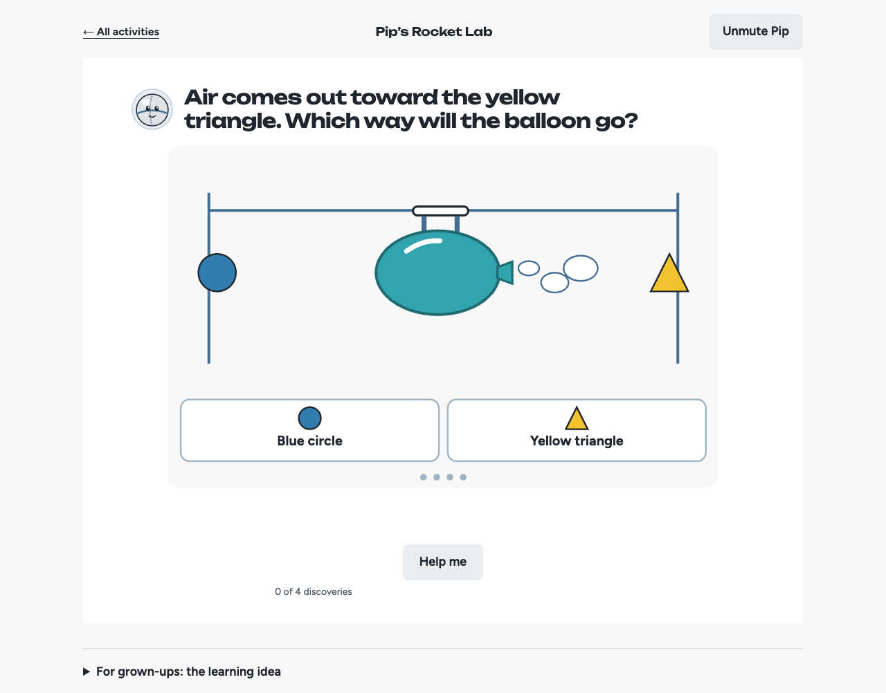
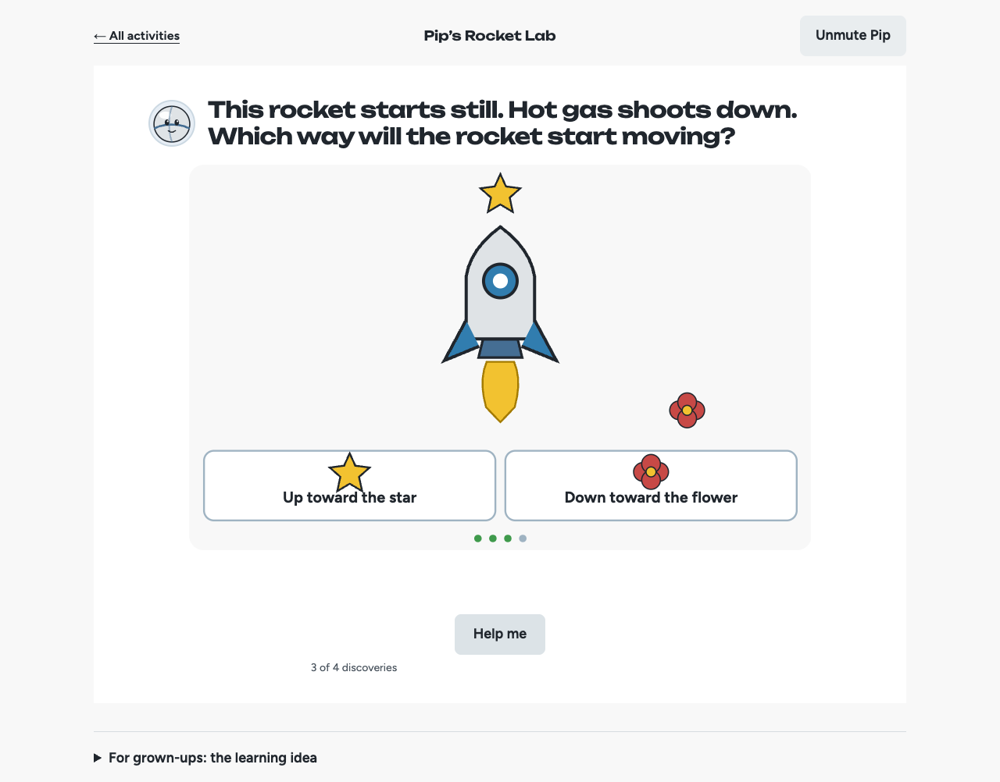
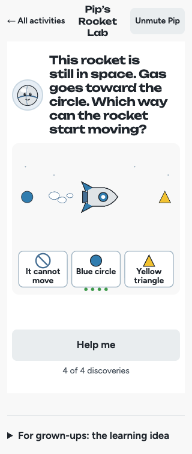
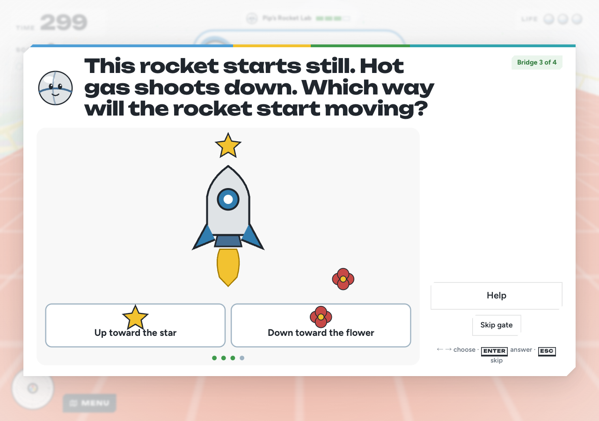
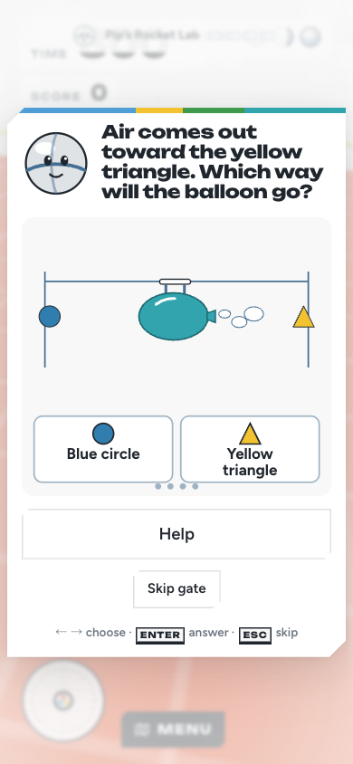

# Pip’s Rocket Lab review candidate

September 30, 2026. Branch: `codex/pip-rocket-lab`. Plan-first commit: `6dafbe8`. This is a review candidate with production disabled.

Pip teaches a balloon experiment before asking four predictions: escaping air to either side, a tied balloon on a level string, then gas down / rocket up. A space example is optional. The same validated data, SVG scene and finite explanation controller serve the standalone lesson and maze checkpoint card.

- Standalone: `/education/lessons/rocket-lab/`.
- Game: `/play/practice?learn=rocket-lab`.
- Build with `VITE_ROCKET_LAB_ENABLED=true`; the default and production build are off.

## Data and completion

The curated `pip-discoveries` path uses strict `wwm-learning/0.5` data with three required capabilities. Trusted scene enums derive starting motion, and marker identity/order must agree. Existing 0.1–0.3 exports and six-activity family storage retain their legacy reader; the separate 0.4 encounter/inventory contract is unchanged.

A correct choice creates a pending explanation. Only the current effect token can count the discovery and complete its maze lock. Replay, double taps and stale callbacks cannot count again. Later cancels the card's work while preserving the accepted choice, and reopening replays the explanation. A mandatory introduction precedes every first-entry route. Required progress excludes the optional space round.

The handmade practice stage supplies four physical posts. Required rounds also remain dependencies of the goal when placement supplies zero or one post; a frozen sparse fixture and lock tests cover this fallback and the grown-up override. No rocket vehicle or new physics loop is involved.

## Delivery and interface

The web build also builds education with `/education/` as its base and copies the entire artifact into the existing Worker asset tree. The strict deployed CSP exposed inline answer-position attributes in the shared education scene; CSSOM hydration now applies trusted numeric geometry. Rocket and Gems remain playable under the same policy.

The existing daylight WWM system uses Figtree, Unbounded, silver Pip and teal/blue/yellow geometric scenes. Choice labels wrap on narrow screens, and color has redundant shape markers. Reduced motion shows before/after frames; audio failure retains a visible paced explanation. Hidden or disposed effects release frames, timers and visibility listeners.

The independent finish review requested removal of the Rocket game's eyebrow and colored explanation side stripe and a documentation update. The named Impeccable roles were unavailable in this harness; fresh generic agents used the equivalent finish-review and documenter contracts. The detector reported only the intentional Rocket typography steps, now recorded in design documentation. The reviewer scored all three fixes resolved and returned **ship**, with no visible regressions: [verdict](../education/rocket-lab-review.md).

## Validation

| Check | Result |
| --- | --- |
| Full local `pnpm check` | Pass: typecheck, lint, 1,624 tests; 48 skipped without their external acceptance inputs |
| Final shared/game lock and effect regression | Pass: the focused 56-case run and final full suite cover motion timing, stale/replay, sparse goal/override and restart cancellation |
| Built Rocket Chromium acceptance | Pass: all five cases; two-app route and compiled assets, full desktop flow with help/replay/skip/restart, 320px keyboard/reduced-motion flow with space, real marble first gate and all required locks, portable-file import and 390px game card |
| Existing education Chromium acceptance | Pass: all 19 tests, including Gems, family versions, keyboard, narrated cue stubs, download and baseline storage |
| Disabled artifact | Pass: unavailable Rocket page, Gems retained; bundled and imported Rocket loader rejection tested |
| Production-CSP run | Pass: no CSP violations in tested Rocket standalone/game routes |
| Effect ownership | Pass: finite motion, reduced frames, hidden/disposal cancellation, slower narration wait and bounded provider failure |

Local execution used Node 26 / pnpm 11.5. CI repeats checks on Node 24 and exercises the enabled built review artifact before rebuilding baseline education. CI status belongs to the exact review commit and is reported in the PR.

## Review screenshots

## Remaining release gates

No paid narration was generated. The reviewed dry run reuses 82 existing clips and needs 32 unique new clips / 2,140 characters; the allowance question remains pending. Browser narration and silent explanation fallback are available for review. Complete authored-clip coverage, actual listening and physical first-tap audio remain unaccepted.

Physical iOS Safari / Android Chrome, an observed parent-guided child session, educator review and same-device performance comparison remain release gates. Automated choices do not establish learning mastery. Hosted PR previews are currently disabled by `WWM_PREVIEWS_ENABLED=false`; this branch does not change that setting. The production flag is explicitly false, and no merge or deployment was performed.

The original mobile-controls checkout and the other nine concept lessons are preserved separately. Rollback is the previous two-app build artifact; no database or family-storage migration is required.
