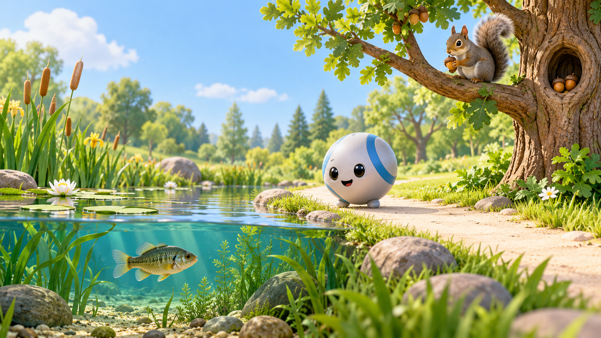
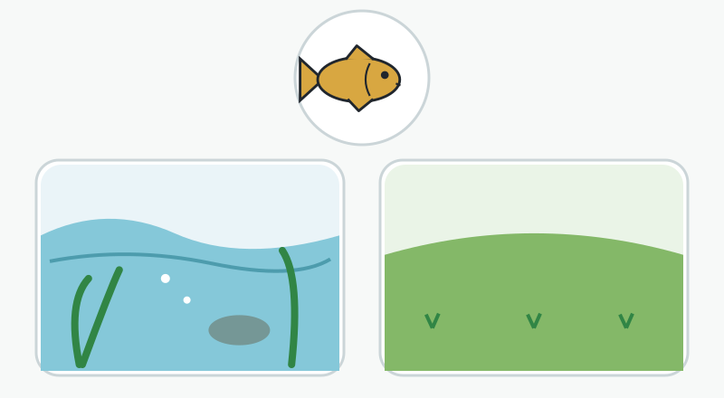
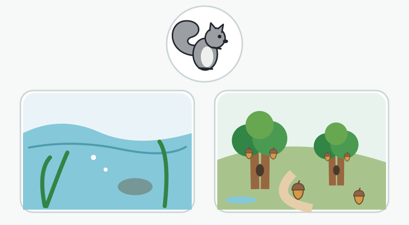
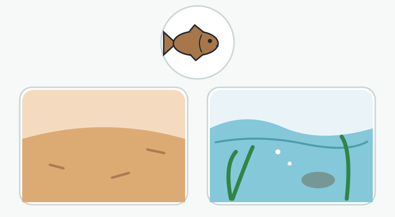
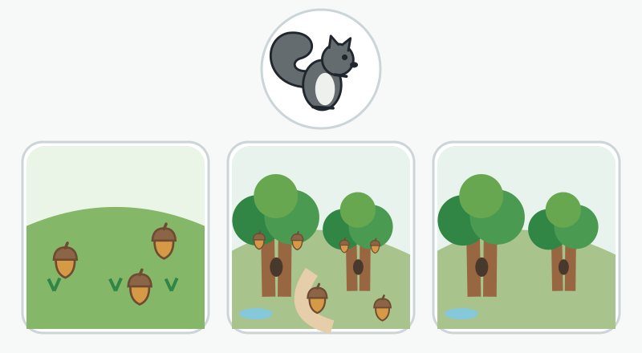
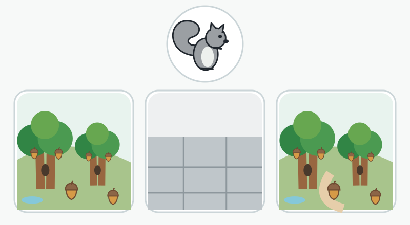

# 8. Animals — Find a Suitable Home

Look for what an animal needs.

**Status:** standalone adult review pack; no game integration or child validation.

**Learning goal:** Use visible environmental clues to choose a suitable place for a pond fish or a tree squirrel, even when its appearance changes.

**Child takeaway:** I look for what the animal needs.

**Estimated duration:** 2–4 minutes.

**Story:** Pip is making a nature map. Help him look for water for a pond fish and useful trees for a tree squirrel. The animals stay safely in their own environments; choices are pictures for the map.

**Pip’s spoken introduction:** “Help me make a nature map! Animals need places with things they use. We can look for those things.”

## Teaching rationale

Start with a stated, visible need: pond fish swim in water, and a tree squirrel uses trees. Then change the fish’s appearance so color matching fails. The fourth round checks two visible clues rather than inventing an exclusively correct habitat. The optional fifth round accepts either of two wooded settings, preserving the idea that animals can use more than one suitable place.

**Misconception to surface:** A matching color or a remembered background tells us where an animal belongs; each species has exactly one kind of home.

**Entry support:** Start with two large picture choices and say the animal’s need in the question. A grown-up can read the prompt; the child may point or say an answer.

**Optional stretch:** In round five, accept either suitable wooded scene and invite the child to point to a useful clue. Naming the other suitable scene is optional.

## Five review rounds

### 1. Water to swim

**Spoken question:** “This pond fish needs water to swim. Which picture shows water?”

**Choices:** A: Pond; B: Grassy patch.

**Accepted single choice:** A.

**Feedback:** “The pond has water. Our pond fish swims in water.”

**Three hints:**

1. “Look for the water.”
2. “Imagine the fish swimming. Which picture gives it water around its body?”
3. “The left picture is a pond. It has water for our pond fish.”

**Visual explanation after help:** Only after a hint, trace the pond water boundary and animate a separate demonstration fish swimming fully underwater. Do not show a fish flopping on land.

**What this reveals:** Establishes a need-based choice with a stated need and an obvious environmental difference.

### 2. Trees to use

**Spoken question:** “This tree squirrel climbs trees. Which picture has trees to climb?”

**Choices:** A: Open pond water; B: Wooded park.

**Accepted single choice:** B.

**Feedback:** “The wooded park has trees to climb. A tree squirrel can use the branches and shelter in a hollow or nest.”

**Three hints:**

1. “Look for trunks and branches.”
2. “Trace a trunk up to a branch. Is it in the pond picture or the park picture?”
3. “The right picture has trees. This tree squirrel can climb them.”

**Visual explanation after help:** Trace a tree trunk to its branch, then show a separate squirrel climbing it. Make the hollow visible; do not imply water is useless to squirrels.

**What this reveals:** Introduces a second animal and a different useful environmental feature.

### 3. Color does not choose the home

**Spoken question:** “This pond fish is brown. Which place has water for it to swim?”

**Choices:** A: Brown sand; B: Blue pond.

**Accepted single choice:** B.

**Feedback:** “The blue pond has water. The fish’s brown color does not change its need for water.”

**Three hints:**

1. “Look for what the fish needs, even if the colors are different.”
2. “Picture the brown fish swimming. Sand is dry; the pond is full of water.”
3. “Choose the blue pond on the right. The brown fish still needs water.”

**Visual explanation after help:** Show brown and golden demonstration fish swimming in the same pond. Do not use crossed-out color patches as the explanation.

**What this reveals:** Checks whether the child uses a need rather than matching the fish’s color.

### 4. Find both useful clues

**Spoken question:** “This tree squirrel uses trees to climb and nuts for food. Which picture shows both trees and nuts?”

**Choices:** A: Nuts on open ground; B: Trees with nuts; C: Trees without pictured nuts.

**Accepted single choice:** B.

**Feedback:** “The middle picture shows both trees and nuts. It shows places to climb and food to eat.”

**Three hints:**

1. “Look for two things: trees and nuts.”
2. “Point to a tree. Now look for nuts in that same picture.”
3. “The middle picture shows trees and nuts together. The other pictures show just one of those clues.”

**Visual explanation after help:** After a hint, reveal two simple tokens for a tree and an acorn, then gently outline each corresponding clue in the middle scene. These tokens are an explanation, not a hidden requirement before the prompt.

**What this reveals:** Transfers from one clue to two visible needs, while carefully asking about the picture rather than declaring every tree-only scene unsuitable.

### 5. More than one place can work

**Spoken question:** “Choose one place with trees, shelter, and nuts for our tree squirrel.”

**Choices:** A: Woodland; B: Bare paved courtyard; C: Wooded park.

**Accepted single choice:** A, C.

**Feedback:** “Either wooded picture works. Both show trees, shelter, and nuts. An animal can have more than one suitable place.”

**Three hints:**

1. “Look for places to climb, a hollow for shelter, and nuts.”
2. “Point to those things in a picture. You may notice them in more than one picture.”
3. “The woodland on the left and the wooded park on the right both show those things. You can choose either one.”

**Visual explanation after help:** After the child chooses or asks for help, show the same clue tokens beside both wooded scenes with equal treatment. Each is an accepted single choice.

**What this reveals:** Optional stretch checks needs across two changed environments and explicitly avoids the one-species-one-home misconception.

## Payoff and offline extension

Pip’s nature map now shows useful pond and woodland places. The fish swims under water; the tree squirrel explores branches. Pip says, “We looked for what each animal uses!”

With a grown-up, draw a pond fish and a tree squirrel. Add water around the fish; add trees, shelter, and food around the squirrel. Ask, “What did you add that helps this animal?” Use drawings rather than moving or feeding wildlife.

## Three decisions for Eric

1. Should the first version stay with these two animals so the child can learn a reasoning pattern before adding more species?
2. Is the two-clue question in round four clear enough, or should we keep one visible need per question until child playtesting?
3. Should the optional final round accept either wooded picture with a single tap, and then invite an explanation without requiring speech?

## Scientific and design limits

- This is an adult review concept, not a tested child experience. The diagrams and exact prompts are the instructional authority; the generated concept image is story art.
- The pictured fish represents a freshwater pond fish, informed by bluegill habitat examples. Do not generalize that every fish can live in any pond or that visually blue water proves suitable water quality.
- The squirrel is a tree squirrel, informed by eastern gray squirrel references. Ground squirrels and other species may have different habitat needs. Trees, acorns, and hollows are useful visible clues, not a complete ecological checklist.
- Round four asks which picture visibly shows both trees and nuts. It does not declare a tree-only landscape an impossible habitat: food may exist beyond the pictured area.
- Round five accepts either woodland or wooded park. The child need not select both or find a hidden preferred answer.
- No amphibians are used as exclusive land-versus-water distractors. If later adding frogs or turtles, recognize their use of both environments and research the named species.
- These scenes do not ask children to release pets, move animals, or feed wildlife. The nature map provides the story action.
- The target duration and age supports are design estimates requiring child observation, not developmental certification.

## Sources checked

- [Minnesota DNR — MinnAqua: Design a Habitat](https://files.dnr.state.mn.us/education_safety/education/minnaqua/leadersguide/chapter_1/1_1_design_a_habitat.pdf): Pages 4–5 explain food, water, cover, and space; bluegills can use the quieter water of many lakes and ponds. Fish species have different water conditions and habitat needs. This reference informs scientific content; its core lesson targets grades 3–5, so it does not validate this age adaptation.
- [National Park Service — Eastern Grey Squirrel, Lowell](https://www.nps.gov/lowe/learn/nature/squirrel.htm): Eastern gray squirrels use woodland and urban parks; their diet includes nuts, acorns, seeds, and berries. More than one environmental setting can support the same species.

- [Minnesota DNR — Gray squirrel](https://www.dnr.state.mn.us/mammals/graysquirrel.html): Gray squirrels use hardwood forests, wooded parks and residential areas. Acorns and other tree seeds are foods; shelter may be a tree hollow or a leafy tree-top nest.

## Assets

- `concept.png`: generated through the built-in image tool, visually inspected for fish submerged in water and squirrel on a tree; includes no instructional labels.
- `image-prompt.txt`: complete generation prompt.
- `round-1.svg` through `round-5.svg`: editable 800 × 440 exact question scenes.
- `lesson.json`: gallery content and answer contract.
