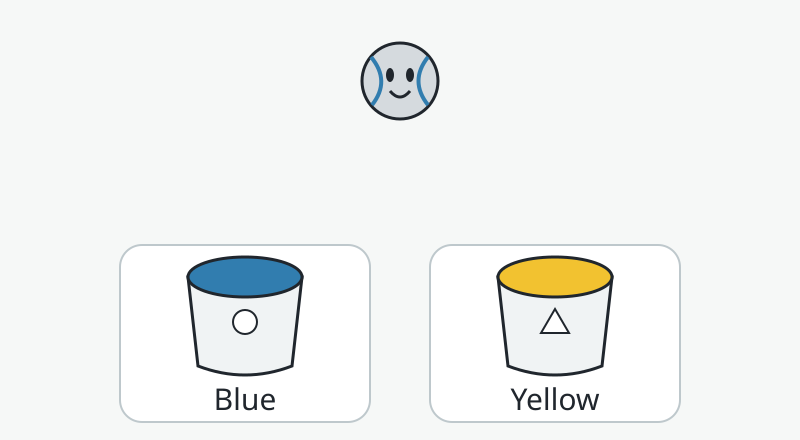
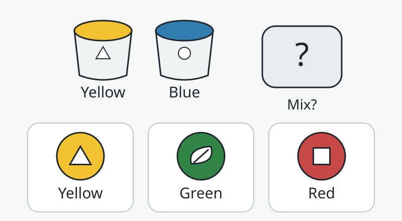
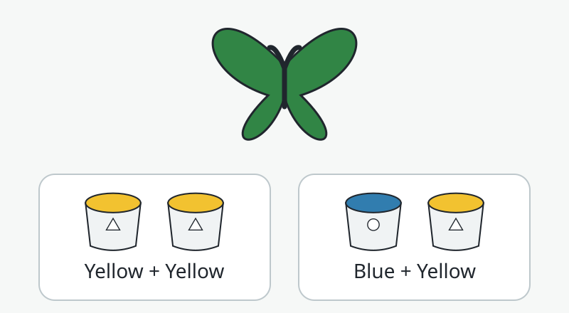
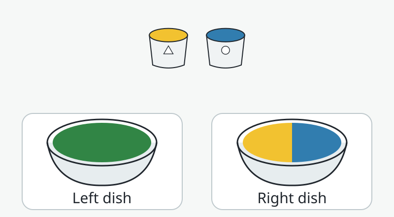
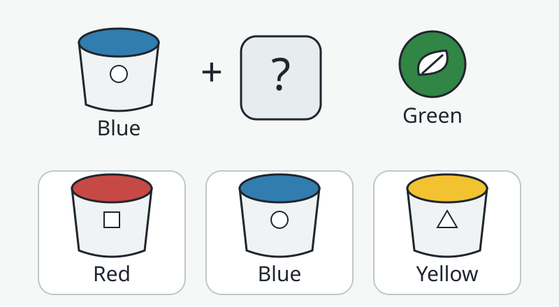

# 7. Pip’s Paint Playground

Mix a little paint. Discover a new color.

## Teaching purpose

After watching a paint-mixing demonstration, choose yellow and blue as the two paints used to make the modeled green, even when their order or the painted object changes.

Pip wants green wings for a butterfly picture, but the art table has yellow and blue paint. The child helps Pip find, mix, and reuse the recipe.

The goal is a usable recipe after an observed change. An initial named-color choice leads into an explicit demonstration; later choices change object, input order, and question direction. The separate-paint check prevents a visual shortcut from replacing the idea of mixing. Every round is replayable, with no timer or precise dragging.

**Pip’s introduction:** “Let’s paint a butterfly! I have yellow and blue paint. Help me find the yellow, then we’ll see what happens when we stir.”

## Five review rounds

### 1. Find the first paint

**Spoken question:** “Which pot has yellow paint?”

**Choices:** Blue paint / Yellow paint

**Answer:** Yellow paint

**Feedback:** “That pot has yellow paint. Watch Pip stir a little yellow with a little blue. These paints make green!”

**Three hints:**

1. Listen as Pip names each pot: blue, then yellow.
2. Look at the yellow paint with the triangle badge.
3. This is the yellow pot. Now we can watch yellow and blue paint mix into green.

**Visual demonstration:** Name and gently pulse each pot in turn. After selection, show separate yellow and blue paint dollops entering one dish, then a visible stirring sequence ending in green. The demonstration is required before round 2.

**Learning reason:** Provides an easy color-identification entry and introduces the paint-mixing demonstration.

### 2. Predict the mix

**Spoken question:** “Pip will stir yellow and blue paint. Which color do you think the mix will be?”

**Choices:** Yellow / Green / Red

**Answer:** Green

**Feedback:** “Yellow and blue made green in our paint dish. Let’s stir and check your prediction.”

**Three hints:**

1. We can replay Pip’s paint experiment.
2. Watch the yellow and blue dollops blend as Pip stirs.
3. The stirred paint is green. Choose the green sample with the leaf badge.

**Visual demonstration:** Offer a replay of the actual yellow-and-blue stirring demonstration; uncover the output only after a prediction or requested hint.

**Learning reason:** Asks for a prediction using the demonstrated recipe; it distinguishes the mixture from either original input.

### 3. Paint a butterfly

**Spoken question:** “Pip wants green paint for this butterfly. Which two paints should Pip mix?”

**Choices:** Yellow + yellow / Blue + yellow

**Answer:** Blue + yellow

**Feedback:** “Blue and yellow make our green paint. Changing which pot comes first does not change this recipe.”

**Three hints:**

1. The butterfly needs the green paint we made.
2. Our green recipe uses two different paints.
3. Mix blue and yellow. They are the same two paints we used before, in the other order.

**Visual demonstration:** Replay the two input dollops in swapped order; show them stir into the same modeled green.

**Learning reason:** Transfers the recipe to a new object and reversed input order; checks that two yellow portions are not treated as green.

### 4. Together or mixed?

**Spoken question:** “Which dish shows the yellow and blue paints stirred together?”

**Choices:** Left dish: one green mixture / Right dish: separate yellow and blue

**Answer:** Left dish: one green mixture

**Feedback:** “The green paint is mixed. In the other dish, yellow and blue are still separate. Pip needs to stir them.”

**Three hints:**

1. Look for one blended paint, instead of two separate patches.
2. Trace where yellow and blue still meet in the right dish. They have not blended yet.
3. The left dish is green all across. The right dish still has separate yellow and blue.

**Visual demonstration:** Trace the unmixed boundary, then animate a spoon blending the right dish. Do not imply paint changes merely because two patches touch.

**Learning reason:** Reveals the misconception that nearby colors automatically become a mixture.

### 5. Finish the green recipe

**Spoken question:** “Pip already has blue paint. Which paint should Pip add to make our green?”

**Choices:** Red paint / Blue paint / Yellow paint

**Answer:** Yellow paint

**Feedback:** “Add yellow to the blue. Those two paints make our green again. Now Pip can finish the butterfly.”

**Three hints:**

1. One part of our green recipe is already here: blue.
2. Replay the recipe and watch which other pot joins blue.
3. Blue needs yellow for this recipe. Choose the yellow pot with the triangle badge.

**Visual demonstration:** Replay the recipe and visually leave the yellow ingredient slot open; after a choice, fill the slot and stir.

**Learning reason:** Optional backward reasoning: supplies the missing ingredient instead of choosing a complete recipe.

## Finale and home exploration

Pip uses the mixed green paint to finish the butterfly wings. The child can replay the stir and choose another outline to paint with the same mixture.

With a grown-up, use small amounts of washable yellow and blue paint on a reusable dish. Predict, stir, and describe the green you actually see. Try reversing the order. Use suitable art materials, keep paint out of mouths, and wash hands afterward.

## Age support and access

**Entry:** Read every color and choice aloud; show the full stirring demonstration after round 1. Permit replay anytime, adult co-exploration, and single taps rather than dragging.

**Stretch:** Round 5 invites finding a missing ingredient. Keep it optional; do not add extra color recipes before demonstrating them.

## Decisions for Eric

1. Is yellow-and-blue-to-green enough for the first lesson, or do you want a separately demonstrated red-and-yellow-to-orange extension later?
2. Does the butterfly story make mixing feel purposeful, or would a vehicle-painting story fit Pip’s world better?
3. Should children who cannot reliably distinguish these colors get an adult-supported explore mode with spoken names and recipe badges, instead of scored color identification?

## Scope, simplifications, and limits

- Standalone adult review concept only. No game integration or child-testing evidence.
- Generated illustration is introductory story art. Exact round SVGs define the learning questions.
- The green is a simplified result for selected yellow and blue paints; actual pigments, proportions, and lighting affect shade and saturation. Test the chosen physical paints before filming or implementing the demonstration.
- This teaches paint mixing. Do not reuse the recipe for colored light or blend screen RGB inputs as if that models pigments.
- Prediction round 2 displays two inputs and an unknown output; the green option is a choice, not a revealed result.
- Color names are read aloud. Persistent badges provide redundant identification: yellow triangle, blue circle, green leaf, red square. The badges are arbitrary identifiers, not a claim that real colors have shapes.
- Labels and badges help follow a known recipe but cannot make color discrimination universally accessible. Offer an unscored narrated explore path or adult co-play; do not assess a child’s understanding solely by hue recognition.
- Round 4 also offers spatial labels and a visible separate-color boundary. Its spoken description supports access but may reveal the answer; prioritize access over treating it as an independent assessment.
- All answer cards have equal neutral borders. No correct-answer highlight in unassisted SVGs. Prompt playback, choice reading, and stirring are design intentions only; this review pack does not produce audio or run a child experience.

## Evidence checked

[Crayola: What are the primary colors?](https://www.crayola.com/faqs/what-are-the-primary-colors-faq) was checked September 30, 2026. It explicitly gives the traditional art recipe yellow + blue = green. This is a manufacturer source for art color mixing, not evidence of learning effectiveness for this design. No child testing has been performed.

## Assets

One built-in imagegen story illustration (`concept.png`), its complete saved prompt (`image-prompt.txt`), five deterministic 800×440 SVG question scenes, and `lesson.json`. Generated art introduces the story; the SVGs are the instructional authority.
