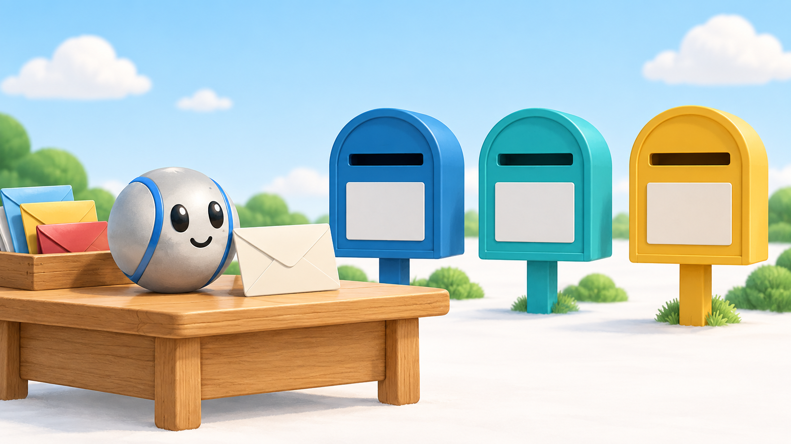
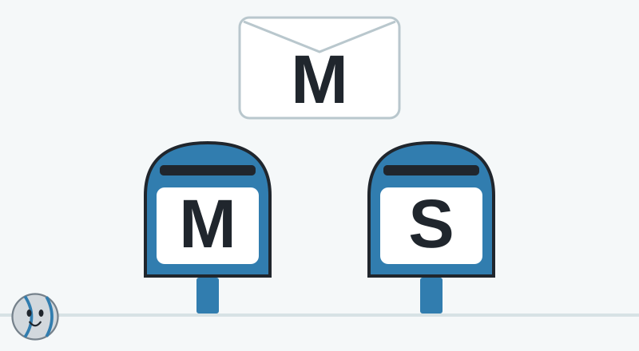
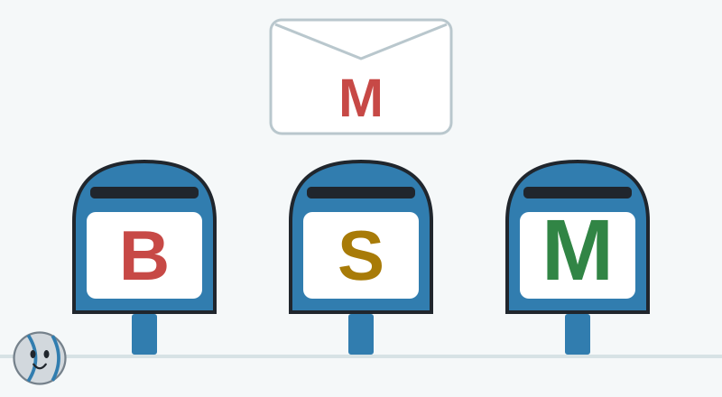
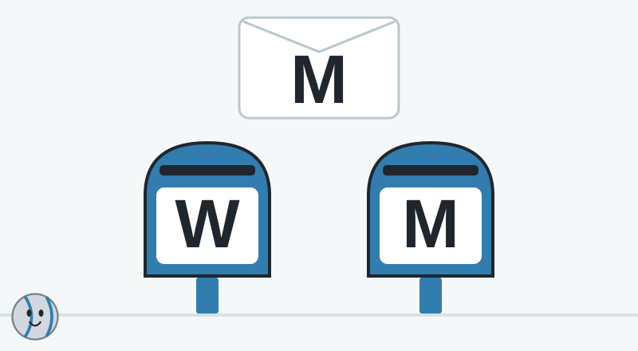
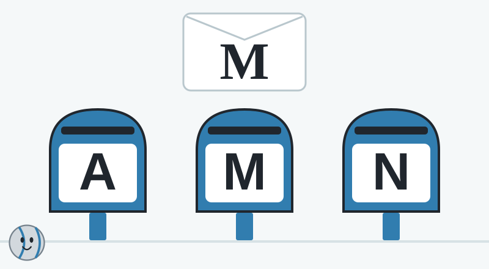
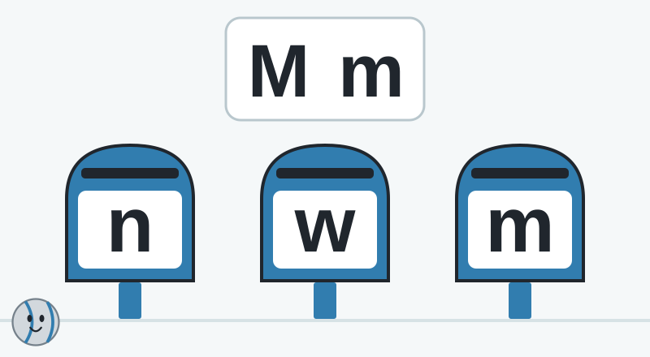

# Pip’s Alphabet Post Office

A standalone lesson concept for adult review. Ages 4–6 are the intended audience; the concept has not been tested with children or integrated into the game.

## Teaching purpose

Recognize a named uppercase M across size, color, position, and simple print variations; distinguish it from a different upright letter.

A child who succeeds should be able to point to an upright M despite changes in color, size, position, and a simple font. The visible target makes the lesson accessible to beginners. Round four begins to check transfer beyond an exact printed match. This cannot establish lasting recognition from a single short session.

The postal story gives matching a purpose: the child delivers an envelope by choosing a large mailbox. There is no required reading, precise dragging, speed, or memorized script. The name “Alphabet Post Office” describes a reusable setting, but this particular session teaches one letter. Later sessions may use a familiar letter from the child’s name.

## Introduction

> Welcome to my post office! Today we’re looking for one letter. This is M. Can you say M with me? Help me find M on the mailboxes.

## Five rounds

### 1. Meet M

**Spoken question:** This envelope shows M. Which mailbox also shows M?

**Choices, left to right:** M — left mailbox; S — right mailbox.

**Answer:** M — left mailbox.

**Feedback:** The envelope and this mailbox both show M. The letter matches, so the envelope can go here.

**Hints:**

1. Look at the letter on the envelope, then look at each mailbox.
2. Watch Pip trace the tall sides and the middle lines of M. Look for those lines on a mailbox.
3. This mailbox has M, just like the envelope. Let’s deliver it together.

**Visual support:** Trace the target M once in a slow blue stroke, then trace both choices without changing their position. On the worked hint, place a copy of the target beside the matching M.

**Why it is here:** An easy visual match establishes one letter and the delivery action without assuming previous alphabet knowledge.

### 2. A new-looking M

**Spoken question:** This red letter is M. Which mailbox shows M, even in a different color?

**Choices, left to right:** B — left mailbox; S — middle mailbox; M — right mailbox.

**Answer:** M — right mailbox.

**Feedback:** The green letter is also M. A letter can change color or size and keep its name.

**Hints:**

1. Look at the lines of M. Its color does not tell us its name.
2. Show the red M changing to green and growing while its lines stay the same. Then return to the choices.
3. The large green M has the same letter shape as the little red M. That mailbox is the match.

**Visual support:** Animate only the target glyph’s color and scale, preserving an upright M; reset the unassisted question before selection. Do not use mailbox colors as answer cues.

**Why it is here:** Separates letter identity from color and size, with a same-color distractor and a changed answer location.

### 3. M and W

**Spoken question:** These letters look a little alike. Which mailbox shows M?

**Choices, left to right:** W — left mailbox; M — right mailbox.

**Answer:** M — right mailbox.

**Feedback:** This letter is M. The other letter is W. We look at the whole letter and the way it stands.

**Hints:**

1. Start with the M on the envelope. Compare its outside lines with each mailbox letter.
2. Trace the two tall straight outside lines of the displayed M, then compare the displayed W’s slanting outside lines.
3. The right mailbox shows the same upright M as the envelope. The left mailbox shows W.

**Visual support:** Compare upright M and W side by side with slow outline traces. Never rotate W into M or say a turned letter keeps its name. The explanation describes these chosen simple fonts, not every decorative typeface.

**Why it is here:** Checks a plausible visual confusion while keeping letter orientation meaningful.

### 4. Another printed M

**Spoken question:** This letter is M, with little feet on its lines. Which mailbox shows M too?

**Choices, left to right:** A — left mailbox; M — middle mailbox; N — right mailbox.

**Answer:** M — middle mailbox.

**Feedback:** Both letters are M. Some printed M letters have little feet, and some do not.

**Hints:**

1. Look for M’s two tall sides and the lines meeting in the middle.
2. Place the serif M and a plain M side by side. Trace the main lines, then briefly show the small feet.
3. The middle mailbox shows M. Its main letter shape matches, even without the little feet.

**Visual support:** Show serif and sans-serif M at the same size side by side; trace shared main strokes and softly mark the serif additions only during the hint. Use conventional upright fonts.

**Why it is here:** Transfers recognition across a modest familiar print variation rather than exact pixel matching.

### 5. Optional: big M, little m

**Spoken question:** This is big M, and this is little m. They are both M. Which mailbox has little m?

**Choices, left to right:** n — left mailbox; w — middle mailbox; m — right mailbox.

**Answer:** m — right mailbox.

**Feedback:** This is little m. Big M and little m are two ways to write the letter M.

**Hints:**

1. Look at little m on our card. Find its shape again on a mailbox.
2. Trace little m’s two rounded humps on the card. Keep the card visible while we compare the choices.
3. The right mailbox has little m, like the card. Big M and little m can look different and share the name M.

**Visual support:** Show and name M and m together before asking; retain that pair as a reference. Trace the conventional lowercase m without morphing uppercase M into it or implying it is just a scaled uppercase glyph.

**Why it is here:** Offers a supported uppercase/lowercase association only after a demonstration. Skippable; completion of the four recognition rounds is sufficient.

## Support and limits

**Beginner support:** Name and display M before the first choice. Keep the target visible, begin with two options, accept pointing or a large tap, and replay the spoken prompt. A grown-up can say the letter name with the child.

**Optional extension:** Round five explicitly shows and names uppercase M and lowercase m before a supported match. Skip it when the child is still exploring uppercase M; later sessions can use a familiar letter from the child’s name.

**Misconception to surface:** A letter is defined by color or size, or every turned shape keeps the same letter name. M and W are different letters; uppercase M and lowercase m are a taught pair, not simple size variants.

- Independent adult review concept; no game integration or child-validation claim. The generated illustration is atmospheric. The five SVGs contain the exact instructional stimuli.
- English alphabet recognition is the current scope. This session teaches one named letter, not the whole alphabet, word decoding, letter-sound mastery, handwriting, or postal addressing.
- Uppercase M remains upright in all rounds. M and W are compared in conventional fonts; rotating or mirroring a glyph is never treated as a harmless appearance change.
- Round five is optional and demonstrated first. Lowercase m is not described as a shrunken uppercase M.
- SVG letters remain editable text, using Arial/Helvetica sans-serif and Times New Roman/Georgia serif fallbacks. Final child delivery must lock and verify fonts on target devices; a font substitution can change the M/W cues.
- The answer positions vary. Mailbox bodies stay the same neutral blue in the question diagrams so color does not disclose the correct answer. Adult choice labels name letters, while child spoken choice labels refer only to position.
- The visible target supports matching; later testing must distinguish recognition from identical-image matching. Round four changes font, but five rounds do not prove durable alphabet knowledge.
- No paid speech service was used. All introductions, questions, feedback, and hints are written scripts for future review.

## Finale and offline play

Each delivered envelope lands in its matching mailbox. The mailboxes gently open, and Pip says, “The mail is home! You found M in different places.” There is no score, timer, or failure screen.

With a grown-up, look for M on a cereal box, a book, or a handwritten card. Say its name and compare its appearance. Make a paper mailbox and deliver a homemade M envelope. Use familiar letters from the child’s name in a later session.

## Decisions for review

1. Should the first play session focus on M for everyone, or let a grown-up choose a familiar letter from the child’s name? Personalization would need equivalent reviewed scenes.
2. Does the M-versus-W comparison feel useful and clear, or should a first-play version keep a more visually distinct distractor and reserve W for repeat play?
3. Should the optional M/m pairing appear only after the four uppercase rounds, or become a separate later lesson to keep the first session focused?

## Evidence

[Head Start’s Literacy Preschool guidance](https://headstart.gov/school-readiness/article/literacy-preschool) describes letter awareness and recognition of familiar letters, including letters in a child’s name, and distinguishes uppercase and lowercase recognition. This supports the direction of a small, familiar-letter lesson. The choice of M, the sequence, the postal story, and the proposed 2–4-minute duration are design assumptions for playtesting; the source does not endorse this lesson or prove mastery.

## Asset verification

The concept illustration was generated with the built-in image generator, then visually inspected and copied into this folder. Mailbox panels and envelopes are blank, Pip has the intended silver-gray sphere and blue seams, and no text or answer cues appear. The illustration has gentle material detail; the exact instructional stimuli are the five editable SVG diagrams. The full prompt is in [image-prompt.txt](image-prompt.txt).

All five SVGs were rendered with macOS Quick Look and visually inspected for letter correctness, choice ordering, readable size, and layout. Pip was moved clear of the mailbox choices after that review. SVGs use a fixed 800×440 viewBox with large upright editable letter text, named choice groups, title/description elements, no selection highlighting, and no answer arrows. Letter fonts must be verified again on the eventual child-facing target platform.
