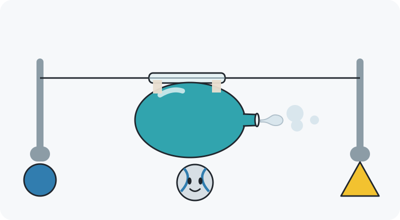
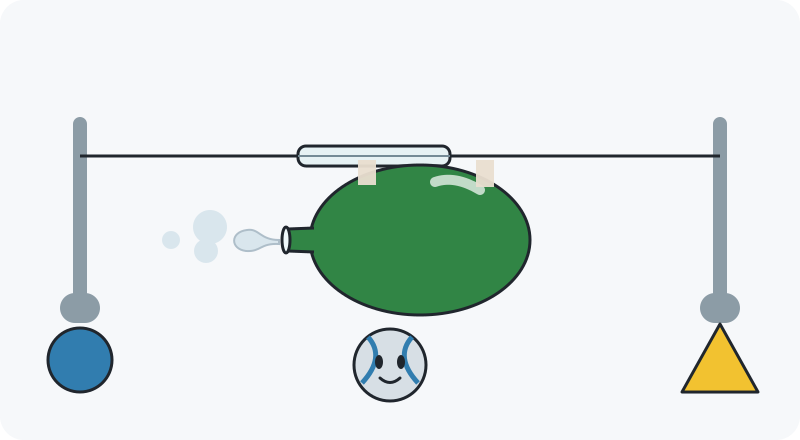
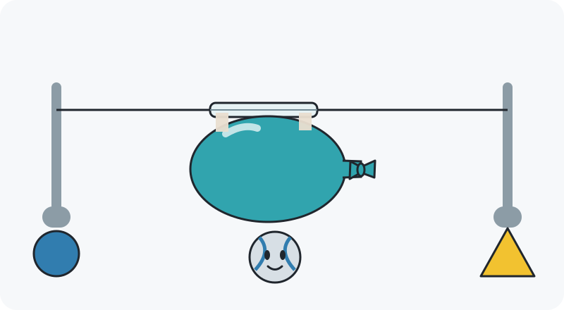

# Pip’s Rocket Lab

Let some air out. Predict the push!

## The learning idea

**Goal:** Predict the direction a balloon rocket or a rocket starts moving when gas escapes from its opening.

**Child takeaway:** Gas goes one way. The rocket gets pushed the other way.

**Story:** Pip is trying a balloon on a string before imagining a space journey. Help Pip predict each launch, then use the same idea for a rocket.

**Spoken introduction:** “Let’s try my balloon rocket! Air is a kind of gas. Watch: air goes out one way, and the balloon gets pushed the other way. Which way will it go next?”

Target time: 2–4 minutes, including a brief demonstration. Ages 4–6 is the intended audience, not a validation claim.

The built-in image generator created the story illustration. The exact prompt is in [image-prompt.txt](image-prompt.txt). Each question uses a separately authored deterministic SVG; these SVGs are the instructional authority.

## Teaching rationale

Begin with a visible action and its effect: gas leaving an opening and the balloon getting pushed in the opposite direction. Change the opening’s orientation before changing the object. The tied-balloon comparison separates being full of air from air escaping. The upright rocket is the concrete transfer, and the space example is an optional extension.

A real or future animated demonstration must precede round one. Read the question aloud and let the child point at a large choice or the matching marker; no reading, dragging accuracy, countdown, speed or maze navigation is needed. After a choice, explain the mechanism and allow another prediction. The blue circle and yellow triangle are redundant shape-and-color direction markers, not rewards.

**Beginner support:** Before round one, a grown-up points to the opening and demonstrates air leaving one way while the balloon travels the other way. The child can point to the large blue circle or yellow triangle instead of naming left and right.

**Ready learner:** Round five applies the same opposite-direction push to a rocket starting from rest in space. It can be skipped without blocking the story’s finish.

**Misconception to address:** A rocket needs nearby air or the ground to push against. Its push comes from expelling its own gas; the engine can also push a rocket in space.

## Five review rounds

### 1. Which way will the balloon go?

**Spoken question:** “Air comes out toward the yellow triangle. Which marker will the balloon move toward?”

**Choices:** Blue circle; Yellow triangle.

**Accepted answer:** Blue circle.

**Success feedback:** “Air leaves toward the triangle. That pushes the balloon the other way, toward the circle.”

**Hints, in order:**

1. “Find the opening where the air comes out.”
2. “Watch a slow demonstration: the air leaves on one side while the balloon slides the other way.”
3. “The air goes toward the yellow triangle, so the balloon goes toward the blue circle.”

**Future visual explanation:** In a future demonstration, animate air leaving to the right and the balloon moving left together. Reveal two contrasting direction arrows only after the child asks for a hint.

**What this reveals:** An easy first prediction follows the introductory demonstration and checks the opposite-direction relationship.

### 2. Turn the balloon around

**Spoken question:** “Pip turned the balloon around. Air comes out toward the blue circle. Which marker will the balloon move toward?”

**Choices:** Blue circle; Yellow triangle.

**Accepted answer:** Yellow triangle.

**Success feedback:** “Turning the opening around changes the push. Air goes toward the circle, and the balloon moves toward the triangle.”

**Hints, in order:**

1. “Look again at the opening. It changed sides.”
2. “Pretend one hand is escaping air. Move your other hand the opposite way.”
3. “Air goes toward the blue circle. The balloon goes the other way, toward the yellow triangle.”

**Future visual explanation:** Animate the reversed experiment with synchronized air and balloon motion. Keep the marker positions fixed so the changed opening is the meaningful difference.

**What this reveals:** The changed example reveals whether the child uses the opening rather than repeating the last marker or following balloon color.

### 3. A balloon tied shut

**Spoken question:** “This balloon is tied shut and held still. No air can escape. When Pip lets go, will it zoom along the string or stay here?”

**Choices:** Zoom along the string; Stay here.

**Accepted answer:** Stay here.

**Success feedback:** “No air is escaping, so there is no rocket push. On our level string, the still balloon stays here.”

**Hints, in order:**

1. “Find the knot. Is there an open place for the air to leave?”
2. “Compare it with the open balloon: the open one lets air out, but this one keeps air inside.”
3. “A tied balloon has no escaping air to give it a rocket push. This one stays where Pip left it.”

**Future visual explanation:** Show the tied balloon remaining still, then replay a separate open balloon releasing air and sliding. Avoid implying that all stationary rockets are out of fuel.

**What this reveals:** Checks whether inflation alone is mistaken for propulsion. The question states no escaping air and no starting motion.

### 4. A rocket uses the same idea

**Spoken question:** “This rocket starts still. Hot gas shoots down from its engine. Which way will the rocket start moving?”

**Choices:** Up toward the star; Down toward the flower.

**Accepted answer:** Up toward the star.

**Success feedback:** “The rocket pushes hot gas down, and the gas pushes the rocket up. It is the same opposite-direction idea as the balloon.”

**Hints, in order:**

1. “Look at the engine opening. Which way is the gas going?”
2. “Use the balloon idea: gas goes one way, and the rocket gets pushed the other way.”
3. “Gas goes down, so this rocket gets pushed up toward the star.”

**Future visual explanation:** Slowly animate gas downward and rocket upward together. Keep the plume off the ground so it cannot be read as a spring pushing on a launchpad.

**What this reveals:** Transfers the mechanism from cold air in a balloon to hot gas in a rocket, while changing the direction to vertical.

### 5. Optional: the push works in space

**Spoken question:** “This rocket is still in space. It sends gas toward the blue circle. Which way can it start moving?”

**Choices:** It cannot move in space; Toward the blue circle; Toward the yellow triangle.

**Accepted answer:** Toward the yellow triangle.

**Success feedback:** “Gas goes toward the circle, and the rocket gets pushed toward the triangle. Its own escaping gas gives the push, even in space.”

**Hints, in order:**

1. “The rocket brings its own gas-making materials. It can push gas out here too.”
2. “Imagine the balloon turned this way. Where would it get pushed?”
3. “The gas goes toward the blue circle. The rocket starts moving the opposite way, toward the yellow triangle.”

**Future visual explanation:** Animate the rocket and its gas moving apart in otherwise empty space. Do not add surrounding air, a surface, or a trailing plume that touches another object.

**What this reveals:** An optional stretch checks opposite-direction transfer without a ground or nearby air. This introduces space thrust rather than testing prior space knowledge.

## Satisfying finish and physical follow-up

Pip launches the balloon toward its chosen marker, then imagines a rocket journey: gas out one way, Pip’s rocket off the other way.

With a grown-up, thread a string through a straw and stretch the string level between two supports. The adult inflates a balloon, holds its neck closed, and tapes it to the straw. Point to where its air will escape, predict its travel, and release. Reverse the balloon and try again. The adult handles balloons and cleans up any broken pieces.

## Decisions for Eric

1. Do the blue-circle and yellow-triangle markers make direction easier to point at, or would two familiar destination objects be clearer?
2. Should the tied-balloon comparison remain round three, or would a second open-balloon prediction better fit the Gems lesson’s existing challenge level?
3. Should the space example stay as the optional fifth round, or be saved for a later rocket lesson after children have tried the physical balloon?

## Limits and design notes

- This is an adult concept pack. Its wording, diagram recognition and 2–4 minute target have not been tested with children.
- The static scenes show where gas escapes, not where the vehicle moves. No unassisted scene includes motion arrows or a highlighted answer.
- A short movement demonstration before round one is required. Static diagrams alone cannot show the push mechanism.
- Visible pale puffs stand in for invisible balloon air. They must be explained as a picture showing where air goes, not as smoke or a new material.
- The string guides a balloon along one line. It is not an engine, and real rockets do not need strings.
- Questions use vehicles starting from rest. The model simplifies friction, gravity and thrust strength; it does not imply that gas direction always equals an already-moving spacecraft’s overall travel direction.
- The upright rocket is an illustrative launch with enough thrust to rise. No landing, orbit, countdown arithmetic, fuel chemistry or rocket safety lesson is included.
- The generated story image has decorative proportions and a slightly angled string. The deterministic SVGs govern the level-string teaching comparison.
- The fifth-round circle and triangle are screen direction markers, not physical objects or destinations floating in space.
- Built-in image generation was used for concept.png. The five SVGs are deterministic diagrams.

## Checked primary sources

- [NASA JPL Education — Simple Rocket Science](https://www.jpl.nasa.gov/edu/resources/lesson-plan/simple-rocket-science/): A straw-and-string balloon experiment, prediction and repeat observation, opposite direction of escaping air and balloon motion, and reversal of the balloon opening.
- [NASA Glenn Research Center — Rocket Thrust](https://www1.grc.nasa.gov/beginners-guide-to-aeronautics/rocket-thrust/): Rocket engines expel hot gas and generate thrust in vacuum without surrounding air. Supports the optional space-transfer explanation.

Both pages were opened and checked on September 30, 2026. They support the science and experiment design; they do not certify this short lesson or its suitability for every child.

## Asset verification

Inspected the generated image and all five SVGs rendered through macOS Quick Look. Confirmed the five scenes have unique title/description IDs, 800×440 viewBoxes, no unassisted motion arrows, and direction/choice correspondence. The JSON has exactly five rounds, two or three choices per round, three review questions and changing accepted-answer positions. No game or package files were changed.
