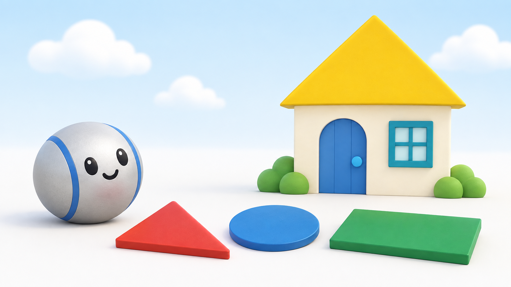
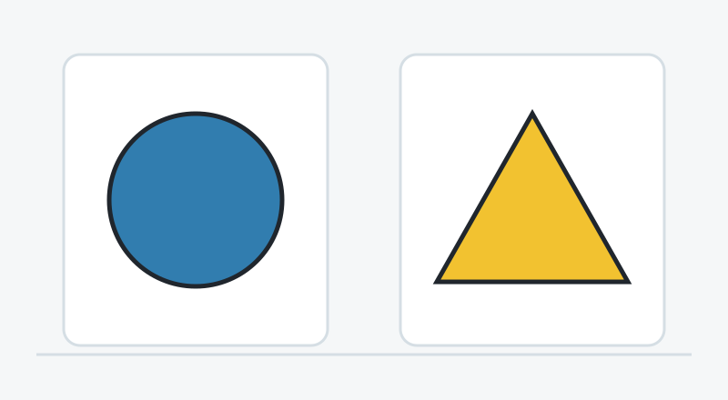
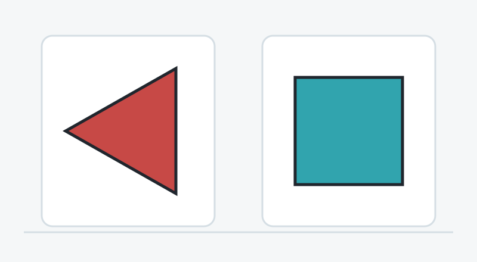
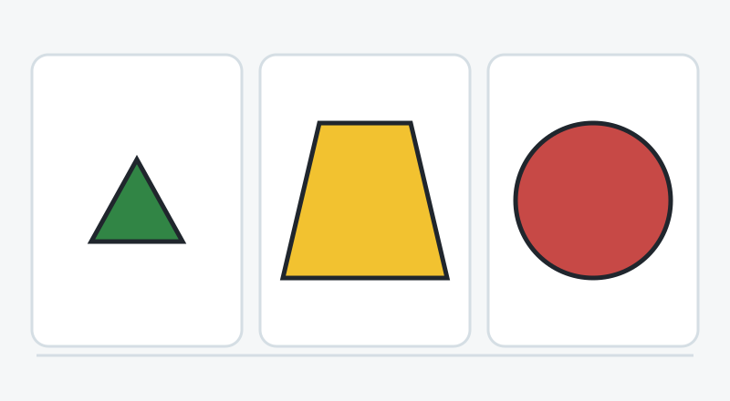
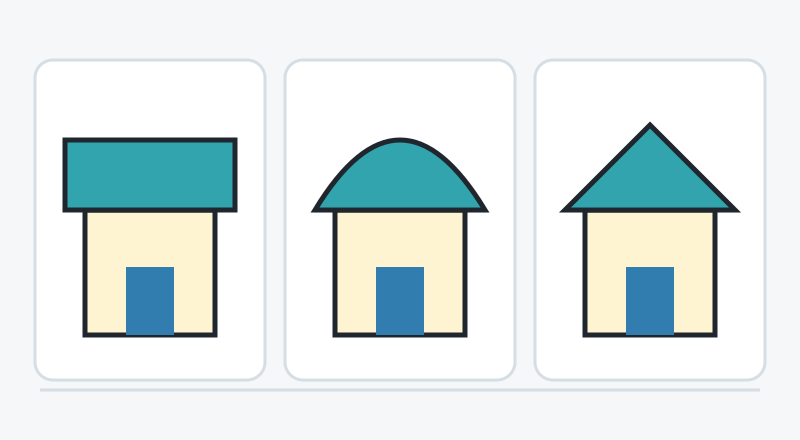
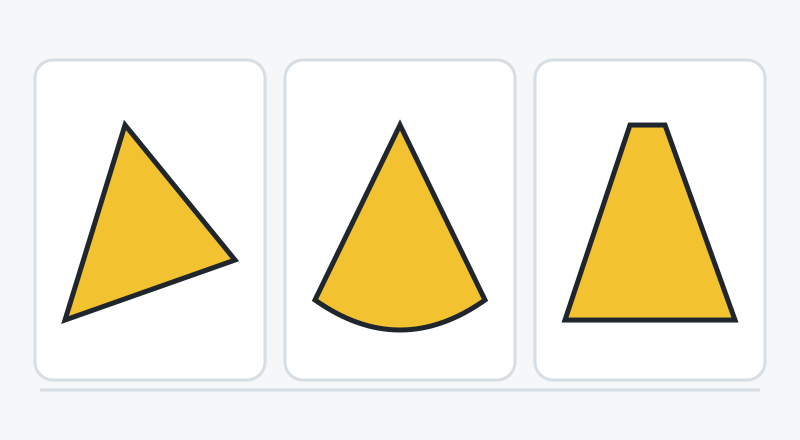

# Shape Builders

A standalone lesson concept for ages 4–6, intended for adult review. No game integration or child testing.

## Goal and teaching rationale

Recognize a triangle by its three straight sides despite changes in orientation, size, width, or color.

This lesson keeps one definition in focus: a flat closed triangle has three straight sides, which meet at three corners. The house story supplies a reason to look, while varied examples prevent teaching only one upright silhouette. It does not introduce a separate circle or rectangle naming objective. The Institute of Education Sciences recommends varied examples and shape attributes; Eastern’s preschool geometry resource emphasizes orientation and attribute-based descriptions. Timing is a design estimate, not validated.

**Pip introduction:** Let’s build my little house! I want a triangle roof. A triangle has three straight sides. We can look for them together.

**Child takeaway:** A triangle has three straight sides. Turning it or making it small keeps it a triangle.

**Story:** Pip is making a little picture house and needs a triangle for its roof. Different pieces look tempting; the child checks their sides to help.

## Round 1: Find our first triangle

**Question:** A triangle has three straight sides. Which shape is a triangle?

**Choices:** The shape on the left; The shape on the right

**Answer:** The shape on the right

**Feedback:** This triangle has three straight sides, and they meet at three corners.

**Hints:**

1. Look at the edges. Which shape has straight sides?
2. Let’s trace each straight side and tap each corner.
3. The right shape has three straight sides and three corners. The left shape has a curved edge.

**Visual demonstration:** Trace all three triangle edges one at a time, then briefly mark its three corners. On the circle, trace the continuous curve without corner dots.

**Purpose:** An easy comparison introduces the defining property in the question rather than assuming prior shape vocabulary.

## Round 2: A triangle can turn

**Question:** I turned the pieces. Which one is still a triangle?

**Choices:** The shape on the left; The shape on the right

**Answer:** The shape on the left

**Feedback:** Turning this triangle does not change its three straight sides.

**Hints:**

1. A triangle can point sideways. Check the sides.
2. Let’s follow the red shape all the way around and count its straight sides.
3. The red shape has three straight sides. The teal shape has four. The red shape is still a triangle.

**Visual demonstration:** Trace the red triangle, then smoothly rotate a duplicate upright while keeping the original visible. Repeat three side pulses before and after turning.

**Purpose:** Tests whether the child relies on an upright roof-like appearance instead of the defining property.

## Round 3: Small is still a triangle

**Question:** Which piece is a triangle, even if it is little?

**Choices:** The piece on the left; The piece in the middle; The piece on the right

**Answer:** The piece on the left

**Feedback:** The little green piece has three straight sides. Size and color do not change its shape.

**Hints:**

1. Look at the sides, not how big the piece is.
2. Trace the little green piece, then trace the yellow piece. Do their sides match?
3. The little green piece has three straight sides. The big yellow piece has four. Only the green piece is a triangle.

**Visual demonstration:** Temporarily magnify all shapes equally, preserving their size relationship; trace each perimeter and show one small dot per corner only after the child requests a hint.

**Purpose:** Checks a size/color misconception and introduces a broad four-sided distractor without asking the child to name it.

## Round 4: A triangle in a house

**Question:** Which house has a triangle roof?

**Choices:** The house on the left; The house in the middle; The house on the right

**Answer:** The house on the right

**Feedback:** The right house has a roof with three straight edges. We found a triangle in a picture.

**Hints:**

1. Look just at the roofs above the doors.
2. Let’s lift each roof into its own picture and follow the outside edge.
3. The right roof has three straight edges. The middle roof has a curve, and the left roof has four straight edges.

**Visual demonstration:** Lift visual duplicates of the three roofs out of the houses without changing geometry or color; trace all three roof perimeters. Do not imply all real roofs must be triangles.

**Purpose:** Transfers shape recognition from separate pieces to a familiar object while keeping the target explicit.

## Round 5: Optional stretch: almost a triangle

**Question:** Which shape has exactly three straight sides?

**Choices:** The shape on the left; The shape in the middle; The shape on the right

**Answer:** The shape on the left

**Feedback:** The skinny triangle has three straight sides. The other pieces look close, but one has a curve and one has four sides.

**Hints:**

1. A pointy top is only one clue. Check every edge.
2. Trace the bottom of the middle shape. Then find the short top edge of the right shape.
3. The left shape has three straight sides. The middle has a curved edge. The right has four straight sides.

**Visual demonstration:** Trace every edge at equal speed and pause distinctly on the right shape’s short top segment; compare the curved edge to a straight guide only within the requested hint.

**Purpose:** Optional attribute-based discrimination: unequal triangle sides are valid, while merely looking pointy is insufficient.

## Support and payoff

**Entry:** Begin with the two-choice round and spoken side tracing. Accept pointing or tapping; let a grown-up count alongside the child. Repeat before advancing.

**Stretch:** Offer round five only when the child is comfortable. Ask how they know, but do not require a verbal explanation or terms such as scalene.

**Finale:** The chosen triangle turns upright and settles onto Pip’s picture house. Pip traces its three straight edges once, then rolls through the door.

**Offline activity:** With a grown-up, draw or cut out two different paper triangles and a square. Turn the pieces and trace their edges together. Invite the child to make a picture house with any triangle they choose. The grown-up handles scissors.

## Questions for Eric

1. Should this first Shapes lesson stay focused on triangles, with rectangles and circles reserved for later lessons?
2. Is the side-tracing hint clearer with spoken counting, corner taps, or both for children who still need counting support?
3. Should the close curved/four-sided examples in round five be optional after four rounds, or move into a later lesson after playtesting?

## Design limits

- Independent adult review concept; no game integration or child validation has been performed.
- The illustration introduces the story. Its soft 3D pieces are not exact geometry tests; the flat SVG diagrams are authoritative.
- Main goal is three straight sides, with three corners used as a confirming cue. No reading, speed, precise dragging, or shape-name vocabulary beyond triangle is required.
- All SVG polygon edges are mathematically straight; triangle vertices are non-collinear. Distractors are clearly curved or four-sided.
- The house story is a drawing/building activity, not a claim that roofs must be triangular or that other shapes cannot function as roofs.
- Round five is optional. A stretched triangle remains a triangle, but children may need more examples than these five before generalizing.
- If implemented later, choice positions and appearance variants should vary between plays without making the small triangle too small to tap.
- Concept image inspected: Pip identity, distinct shapes, no text, and clean story composition are present; roof and loose pieces have softly rounded material edges, so exact side/corner teaching stays in SVGs.

## Checked primary sources

- [Institute of Education Sciences: Teaching Math to Young Children for Families and Caregivers](https://ies.ed.gov/use-work/resource-library/resource/other-resource/teaching-math-young-children-families-and-caregivers): Supports comparing shape attributes, varying triangle examples, tracing/counting sides or angles, and reorienting shapes in building and puzzles. It does not validate this five-round concept or timing.
- [Eastern Connecticut State University Center for Early Childhood Education: Geometry](https://www.easternct.edu/center-for-early-childhood-education/supporting-mathematical-development/geometry.html): Supports describing shapes by attributes and offering different orientations; the teacher transcript uses three sides to identify a triangle. It does not certify this digital lesson.

Generated illustration uses the built-in image generation tool. The complete prompt is in [image-prompt.txt](image-prompt.txt). Five exact SVG diagrams and [lesson.json](lesson.json) define the review content.
