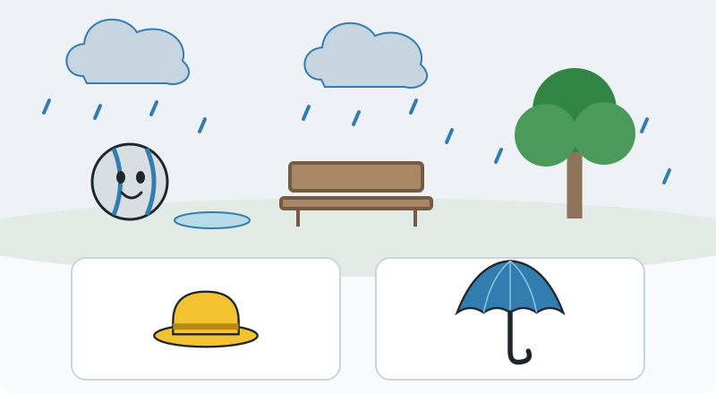
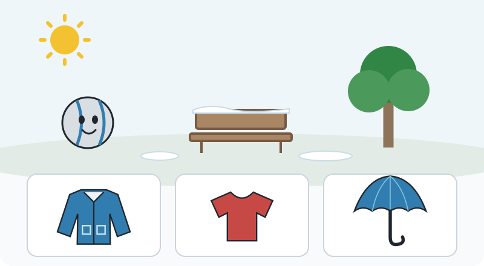
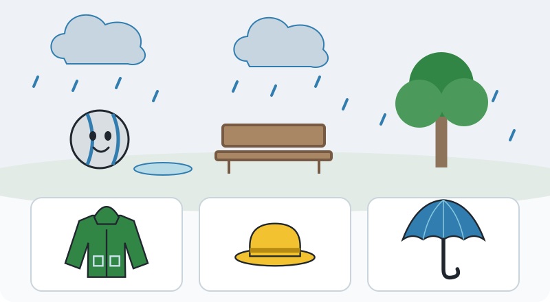

# Weather — Ready for Outside

Look, listen, and help Pip choose for today.

An independent adult review pack for ages 4–6. Five question scenes and one built-in ImageGen story illustration; no game integration or recorded voice.

**Learning goal:** Use visible weather and a spoken temperature clue to choose an item that helps with a specific outdoor task.
**Child takeaway:** I look at the weather and choose something that helps.
**Length:** 2–4 minutes (proposed, not child-tested).

**Story:** Pip wants a short walk to the park bench. The same park feels different as weather changes, so Pip needs help choosing useful clothing and equipment.
**Pip introduction:** “I’m going outside! Look at the weather with me. We can choose something that helps for today.”

The concept illustration sets the scene. The exact SVG diagrams are the authority for question content. The card order matches each round’s choices.

## Five rounds

### 1. A roof for the rain

**Spoken question:** “It is raining. Pip wants to open a wide cover and hold it above him. Which item can do that?”

**Choices:** A: Brimmed hat; B: Umbrella.
**Accepted:** Umbrella.
**Feedback:** “The open umbrella makes a wide cover above Pip. Falling rain hits the cover.”

**Staged hints:**

1. Look at the falling drops. Pip wants a cover that opens above him.
2. Imagine each item opened or worn. Which makes a wide roof above Pip?
3. The umbrella opens into a wide cover. Hold it above Pip to catch the falling drops.

**Visual explanation:** Place the umbrella above Pip, then animate drops hitting its canopy. No cue is present before the hint.
**What it tests:** An easy functional match between visible rain and an opening overhead cover; the task wording distinguishes the umbrella from the rigid pictured hat.

### 2. A warmer layer

**Spoken question:** “It is cold and dry today. Which layer could help Pip feel warmer outside?”

**Choices:** A: Shorts; B: Toy ball; C: Warm coat.
**Accepted:** Warm coat.
**Feedback:** “A warm coat adds a layer around Pip. That layer can help him feel warmer in the cold air.”

**Staged hints:**

1. Listen to the weather clue: it is cold. Pip needs a warmer layer.
2. Look for clothing that covers much of the body. The ball is for playing.
3. The warm coat covers the body and adds a warm layer. Shorts cover much less.

**Visual explanation:** Show the coat wrapping around a neutral mannequin beside Pip, then compare how much body it covers with the shorts.
**What it tests:** Transfers from keeping rain off to adding warmth. The spoken temperature clue supplies information that a cloudy sky alone cannot give.

### 3. Sunshine can be cold

**Spoken question:** “The sun is shining, but the air is cold. Which layer could help Pip feel warmer?”

**Choices:** A: Warm coat; B: Thin shirt; C: Umbrella.
**Accepted:** Warm coat.
**Feedback:** “The coat adds a warmer layer. Sunshine and cold air can happen together, so we listen to how the air feels too.”

**Staged hints:**

1. We can see sunshine. What did Pip say about the air?
2. Pip said the air is cold. Think about a layer that covers his body and helps keep warmth close.
3. Choose the warm coat for the cold air. A sunny sky does not tell us the air is warm.

**Visual explanation:** Replay the words “the air is cold,” then compare the coat and shirt coverage. Keep the sun visible throughout.
**What it tests:** Reveals the misconception that sunshine always means warm weather without asking children to read a thermometer.

### 4. Shade for a face

**Spoken question:** “The sun is shining. Pip wants shade over his face while he walks. Which item helps?”

**Choices:** A: Boot; B: Brimmed hat; C: Warm coat.
**Accepted:** Brimmed hat.
**Feedback:** “The hat’s brim sticks out over Pip’s face and makes some shade there.”

**Staged hints:**

1. Pip wants shade on his face. Look for something worn above the face.
2. Imagine wearing each item. Which has a part that sticks out over the eyes?
3. The brimmed hat has a wide edge. That edge can make shade on Pip’s face.

**Visual explanation:** Place the hat on Pip and show a simple face-shadow patch beneath the brim. Explain partial shade only.
**What it tests:** Transfer to a clearly stated sun-related task. It asks about making shade, not inferring temperature or providing complete sun protection.

### 5. Two sensible rain helpers

**Spoken question:** “Rain has started in this same park. Pip wants to keep falling rain off his clothes. Choose one item that could help.”

**Choices:** A: Raincoat; B: Brimmed hat; C: Umbrella.
**Accepted:** Raincoat, Umbrella.
**Feedback:** “A raincoat covers clothes; an umbrella makes a cover above them. Either can help with this gentle falling rain. You can choose one.”

**Staged hints:**

1. The place is the same, but the weather has changed. What is falling from the clouds?
2. Pip wants to cover his clothes. A cover can be worn around them or held above them.
3. A raincoat covers clothes, and an umbrella catches rain above them. Both are sensible choices here. Choose either one.

**Visual explanation:** After the choice, offer a demonstration of either strategy: drops hit the raincoat, or drops hit the umbrella overhead. Never require selecting both.
**What it tests:** An optional stretch checks a changed weather condition and accepts two reasonable solutions to the same functional task.

## Why these choices

The questions ask what an item does for a stated task. They avoid teaching one universal correct outfit. Weather is information to use: visible precipitation and sky conditions are paired with spoken temperature information when needed. The sunny-but-cold round separates warmth from sunshine. The same bench, tree, and Pip coordinates remain in rounds four and five so a child can see that weather changes at the same place.

Round five is an optional stretch. Either raincoat or umbrella succeeds after one selection; selecting both is not required. A future interaction should make the chosen strategy visible and offer the other demonstration without a penalty.

**Entry support:** Offer two choices, name both aloud, and model looking at the sky. State cold or warm in speech; do not expect the child to read weather symbols.
**Stretch:** Ask the child to explain a useful choice, then notice that the same place can need a different item after weather changes. Round five accepts either of two sensible choices.
**Misconception:** A sunny sky always means the air is warm, or there is only one correct outfit for every kind of weather.

**Finale:** Pip checks the weather again, chooses a useful item, and reaches the park bench ready for the short walk. The child can explain one choice in words or by pointing.
**Offline activity:** With a grown-up, look through a window and name what you can see. Have the grown-up say whether the air feels cold or warm, then choose one useful item for a planned short outing and explain what it helps with.

## Adult review questions

1. Does “which item helps with this task?” feel more inviting than testing a single correct outfit, and is the task understandable without reading?
2. Should the sunny-but-cold example stay in the core five rounds, or become an optional stretch for children who are ready?
3. In the last round, should we show both sensible rain strategies after one selection, or let the child request the second demonstration?

## Design limits

- Adult review concept only; no game integration, voice service calls, child testing, or curriculum validation has occurred.
- Spoken weather conditions are part of the stimulus: sunshine alone does not establish temperature, and clouds alone do not establish cold.
- Question scenes have no answer-revealing highlights, arrows, checkmarks, or selected styling. Choice order changes.
- Pip is a fantasy ball character; garment demonstrations would need a simple mannequin or clear symbolic dressing interaction, not a claim about ball anatomy.
- The functional task narrows each choice. Accept culturally reasonable clothing alternatives in a future implementation rather than treating one pictured outfit as universal.
- Round five accepts raincoat OR umbrella as an individual answer. It is not a hidden multi-select task. The brimmed hat alone does not cover Pip’s clothes as requested.
- Hat feedback describes partial face shade. This pack does not present any one item as complete sun protection or offer medical advice.
- Gentle ordinary weather is used. Severe-weather safety, wind-driven rain, weather forecasting, temperature reading, and cloud taxonomy are outside this short lesson.
- The NOAA source supports observing separate weather features and noticing change; it does not validate this preschool lesson or prescribe particular outfits.

## Checked reference

[NOAA: Be a Citizen Weather Reporter](https://oceanservice.noaa.gov/education/dyw-weather-reporter.html) supports separate observation of temperature, precipitation, and sky conditions and noticing change over time. It does not certify the proposed lesson or prescribe outfits. Checked 2026-09-30.

## Asset inspection

The generated illustration was inspected: Pip’s silver-gray ball body and blue seams, the separate umbrella/raincoat/hat, gentle rain, and porch/park context are visible. It is story art with more detail than the question scenes. All five diagrams were rendered with macOS Quick Look and inspected. Their option cards are neutral and equally styled; coat sleeves were lengthened after inspection for clearer recognition. Each has unique IDs, 800 × 440 dimensions, and title/description accessibility metadata.

Complete image prompt: [image-prompt.txt](image-prompt.txt). Built-in image generation was used.
