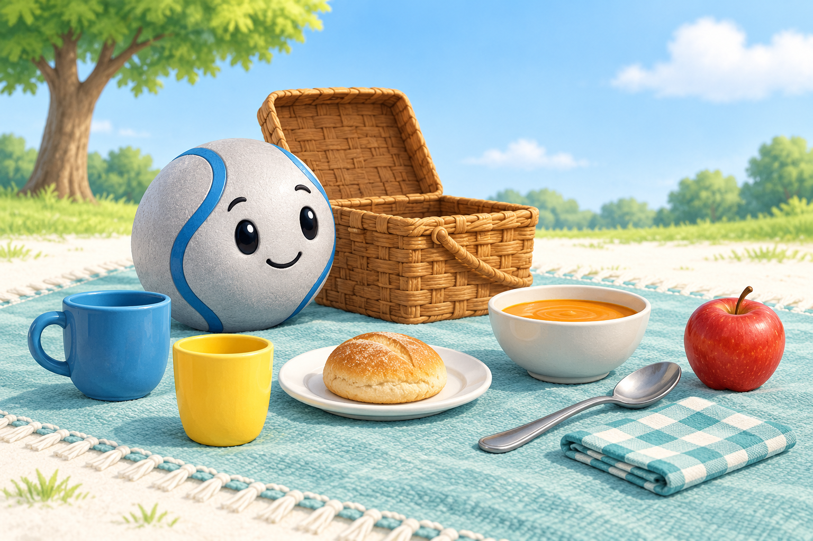
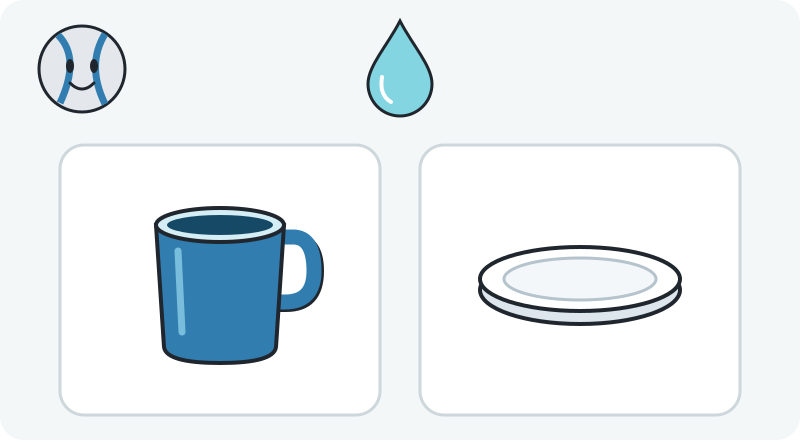
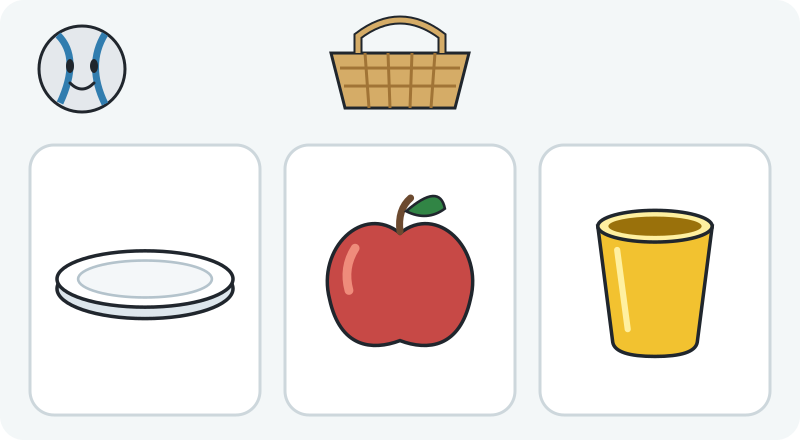
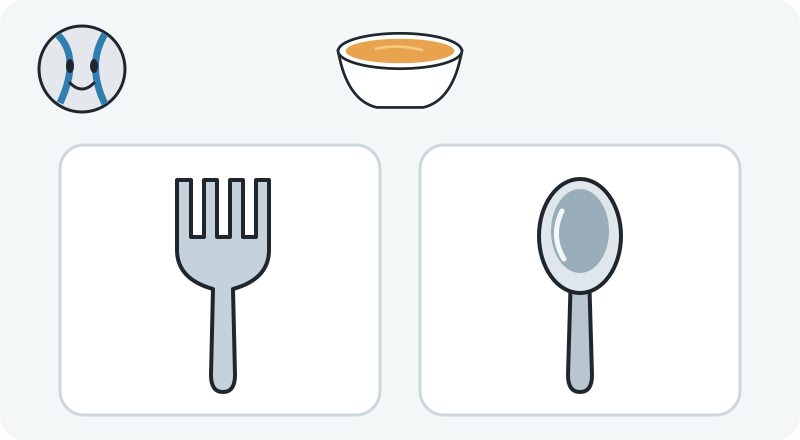
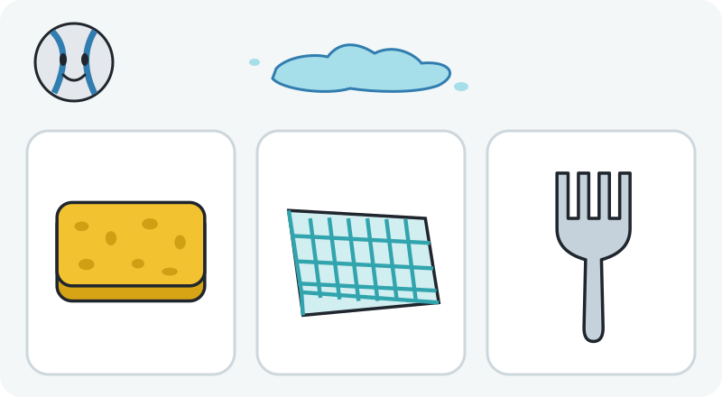
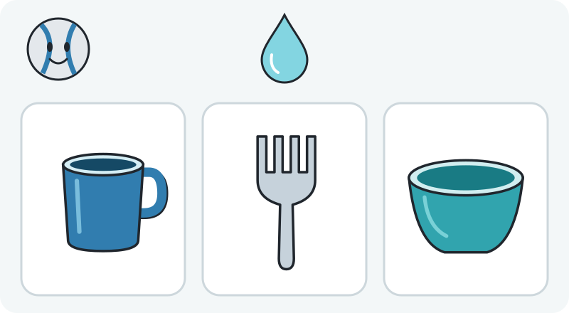

# Pip’s Picnic Pack

Lesson 5: Words & associations. Independent visual and content concept for ages 4–6. Estimated length: 2–4 minutes. This is an adult review pack; it has no game integration and has not been tested with children.

## Teaching idea

Use a spoken everyday word or short functional description to choose a suitable pictured object, including a changed example.

Child takeaway: “Things can look different and still help us do the same job.”

Pip is packing a picnic and needs help finding objects for a drink, soup, and a small spill. The progression starts with a familiar action, changes the appearance of a named object, compares two similar tools, then makes room for several appropriate objects serving the same function. A child's gesture, point, sign, or spoken answer can show understanding. Fluent spoken English is not a prerequisite for participation.

Spoken introduction: “Will you help me pack my picnic? Listen, then point to a thing that can help.”

## Visuals

The story image was generated with the built-in imagegen tool. Its complete prompt is in [image-prompt.txt](image-prompt.txt). The question diagrams below are deterministic 800×440 SVGs. Each option has the same neutral panel and none is highlighted as correct. The diagrams, rather than the generated illustration, define the objects for each question.

## Five questions

### 1. A drink for Pip

**Say:** “Pip is thirsty. Which thing helps Pip drink water?”

**Choices, left to right:** Blue handled cup (say “A cup”); Shallow plate (say “A plate”).

**Accept:** Blue handled cup. 

**Feedback:** “The cup holds a drink. Pip can lift it and take a sip.”

Hints, offered in order:

1. “Look for a place to hold Pip’s drink.”
2. “Pretend to lift each thing and take a sip. Which is made to hold a drink?”
3. “This is a cup. Water stays inside its deep sides, ready for a sip.”

**Proposed visual explanation:** After help is requested, show water going into the cup and a simple tipping-for-a-sip demonstration; show the plate’s shallow surface without declaring all plates incapable of holding any liquid.

**Why it is here:** Starts with a familiar functional association and two distinct silhouettes; no reading or naming aloud is required.

### 2. A cup can look different

**Say:** “Find a cup for Pip’s drink.”

**Choices, left to right:** Shallow plate (say “A plate”); Apple (say “An apple”); Yellow handleless cup (say “A cup”).

**Accept:** Yellow handleless cup. 

**Feedback:** “This cup has no handle, and it is still a cup. Its sides hold a drink.”

Hints, offered in order:

1. “A cup does not have to be blue.”
2. “Look at the open top and deep sides. Try imagining a drink inside.”
3. “The yellow one is a cup too. Cups can have different colors and shapes, with or without a handle.”

**Proposed visual explanation:** On request, place the earlier blue cup beside the new yellow cup outside the choice area; trace the opening and deep sides on both, then fill them equally.

**Why it is here:** Changes color, shape, handle, and position so a remembered blue-cup picture is insufficient.

### 3. Scoop smooth soup

**Say:** “Pip has smooth soup. Which tool can scoop it?”

**Choices, left to right:** Fork (say “A fork”); Spoon (say “A spoon”).

**Accept:** Spoon. 

**Feedback:** “The spoon’s little bowl can scoop the smooth soup. A fork’s gaps let it run through.”

Hints, offered in order:

1. “Think about lifting some smooth soup.”
2. “Look closely at the end of each tool. One has a little bowl; one has gaps.”
3. “The spoon can hold a scoop of smooth soup in its little bowl. Choose the spoon.”

**Proposed visual explanation:** Only after requesting help, animate each listed tool dipping into the same smooth soup: a spoon lifts liquid while liquid passes between the fork’s tines. Do not use chunky soup or imply that people must use spoons to eat all soup.

**Why it is here:** A closer comparison between two eating tools checks function rather than broad picnic membership.

### 4. Clean a little spill

**Say:** “Pip spilled water. Choose one thing that can wipe it up.”

**Choices, left to right:** Sponge (say “A sponge”); Cloth napkin (say “A cloth”); Fork (say “A fork”).

**Accept:** Sponge or Cloth napkin. Any one accepted choice is enough; no multi-select is required.

**Feedback:** “A sponge or a cloth can wipe up this little spill. You found a thing that helps.”

Hints, offered in order:

1. “Look for something that can soak up a little water.”
2. “Imagine pressing the sponge or cloth onto the spill. They can take up water.”
3. “The sponge and the cloth can both help. Choose either one.”

**Proposed visual explanation:** After help, show both the sponge and cloth in separate equal demonstrations absorbing a portion of a small water spill; neither should be treated as the only approved household method.

**Why it is here:** Transfers from naming containers and tools to an action word, and explicitly accepts two appropriate objects.

### 5. More than one way

**Say:** “Choose one thing that can hold water for drinking.”

**Choices, left to right:** Blue handled cup (say “A cup”); Fork (say “A fork”); Deep bowl (say “A bowl”).

**Accept:** Blue handled cup or Deep bowl. Any one accepted choice is enough; no multi-select is required.

**Feedback:** “The cup and the bowl can both hold water. People can drink from different kinds of vessels.”

Hints, offered in order:

1. “Look for an open inside with sides around it.”
2. “Imagine pouring a little water into the cup and the bowl. Where can it stay?”
3. “The cup and the bowl can both hold a drink. Choose either one.”

**Proposed visual explanation:** On help request, add an equal water level to the cup and bowl. Show sipping from each as optional examples, with no hierarchy between the two.

**Why it is here:** Optional stretch separates the functional category from the word cup and welcomes familiar drinking practices from different households.

## Payoff and offline extension

Pip has a drink, a tool for the soup, and something to clean the spill. The basket opens onto a calm picnic; Pip uses the chosen suitable objects.

With a grown-up, put out a cup, a bowl, a spoon, a fork, and a small cloth. Ask, 'What could help us have a drink?' and 'What could wipe up a little spill?' Accept a child’s sensible explanation; use a small amount of cool water only if wanted.

## Support and limits

- **Entry:** A grown-up may say the prompt in the child’s home language, name every pictured option neutrally, or demonstrate the action with real objects. Accept pointing, signing, or speech; repeat freely.
- **Stretch:** After a choice, invite the child to name another thing that can do that job or explain the choice. Round five is optional; accepting either sensible vessel is enough.
- **Misconception to explore:** An object’s color, handle, or familiar appearance is not its whole meaning. A cup can look different, and more than one object can do the same job.

- The generated picture introduces the story. The five deterministic SVGs are the exact question scenes and contain no instructional text.
- Prompts are proposed spoken copy. This review pack has no voice files, scoring, maze, game wiring, or child-testing results.
- Round three asks about a tool for smooth liquid soup; a bowl can also be lifted to drink soup. It is intentionally not a test of universal eating etiquette.
- Multiple correct IDs mean any one listed choice is acceptable, not a hidden multi-select task. Round five avoids excluding drinking from a bowl.
- A child who identifies an unusual sensible use should receive adult acknowledgment rather than a punitive failure. Picture recognition and English familiarity must not be mistaken for total vocabulary knowledge.
- A future child interface should allow replay, home-language narration, pointing or large taps, and generous time. This adult review pack does not establish developmental validation.
- Keep contrastive comparisons about object functions; do not make color matching or basket membership the answer.
- Hints are proposed demonstrations, described here for review; the unassisted SVGs do not include answer-revealing arrows or highlight a correct option.

The first two questions pair cup with drink. They do not establish that cups are the only possible drinking vessels. The stretch explicitly accepts a bowl. A plate in the warm-up is a shallow food plate; if a child explains another workable use, acknowledge that explanation rather than treating household practices as an error. The fork comparison concerns scooping smooth liquid with one of two pictured tools, not whether a fork is an appropriate utensil in every situation.

## Questions for Eric

1. Should the lesson mainly practice object names, or functional language such as drink, scoop, and wipe? The current version mixes both; which emphasis fits the Gems lesson’s scope?
2. Do you want both sensible answers visible in rounds four and five, with any single choice accepted, or would a simpler first release use only one suitable option per question?
3. Are these vessels and picnic objects familiar to the intended children, and which home-language words or household alternatives should the review include?

## Source grounding

- [Head Start — Language Preschool](https://www.headstart.gov/school-readiness/article/language-preschool) — P-LC 2 addresses understanding simple spoken questions; P-LC 6 and 7 address meaningful everyday vocabulary and relationships among words. Used to inform the goal, not to certify this lesson.
- [Head Start — Language and Literacy](https://headstart.gov/school-readiness/effective-practice-guides/language-literacy) — Distinguishes receptive and expressive language, supports culturally and linguistically responsive teaching, and recommends family routines and home materials.

The Head Start guidance informs the receptive-vocabulary aim and culturally responsive support. The proposed five rounds, difficulty, duration, and artwork are design choices awaiting review; the sources do not certify this pack or validate outcomes for a particular child.

## Asset review

- Concept illustration checked visually: one Pip; no text or watermark; recognizable cups, spoon, soup bowl, plate, napkin, apple, and picnic basket. The soft rendered material treatment is an introductory art style and is not used to resolve exact answers.
- All question diagrams use neutral option treatment and match the listed choices in left-to-right order.
- No audio generation, runtime hooks, routes, dependencies, or game behavior are included.

