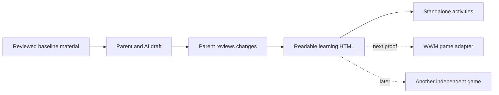

# The education opportunity after the first path

September 26, 2026. These are hypotheses and decision gates, not implementation or spending commitments.

## Working proposition

Parents choose a legible learning path, personalize it with AI, and take it into compatible play experiences. The proposed value is parent understanding and control plus useful reuse across games. A new file format alone is not evidence of demand.

## Existing approaches to learn from

Research checked September 26, 2026; primary sources only.

| Approach | Existing role | Implication for this project |
| --- | --- | --- |
| [LRMI / DCMI](https://www.dublincore.org/specifications/lrmi/) | Describes learning resources using established metadata vocabulary | Map discovery metadata where practical rather than claiming all educational markup is new |
| [H5P](https://h5p.org/node/2464) | Authoring, sharing, and reuse of interactive content | Test whether our parent-review and game-specific presentation add value beyond embedding an existing activity |
| [Experience API](https://github.com/adlnet/xAPI-Spec/blob/master/xAPI-Data.md) | Communication about learning activities and experiences | Future evidence records are a separate concern from content publishing; do not design a proprietary learner-record service prematurely |

No compatibility with these specifications is implemented. Their existence means the differentiation needs to be demonstrated through a better family experience and faithful reuse, not asserted as a novel category.

## Sequence of proofs

1. **Understand and enjoy:** hone this starter path with parents and children. Can a parent explain the objective and spot an unsuitable AI change? Can the child engage with the activity without repeated adult UI troubleshooting? An educator reviews the actual material.
2. **Carry the learning into WWM:** use the same exported HTML and one explicit supported activity type. Compare discovery/checkpoint moments with recovery moments. Preserve choice and avoid presenting lessons as penalties. Keep movement skill separate from educational evidence.
3. **Prove independent reuse:** a second small game reads the same document without editing lesson content. If that requires rewriting objectives or assessment rules, revise the contract before recruiting publishers.
4. **Reduce authoring effort:** test integrated AI drafts, richer content variations, and parent review. Add signed-in family ownership and versioned publishing only with an explicit account/data design. Current copy/paste friction is deliberate pilot scope, not the desired final experience.
5. **Choose one expansion:** older-child math, language practice, or educator-authored themed paths. Select from observed demand and content-review capacity.

## Who might pay, and what remains unknown

Family subscriptions for useful content/personalization, publisher authoring tools, and a game integration service are different businesses. None has validated willingness to pay here. Interview parents about current alternatives and what they would give up for this; ask educational publishers whether they would adopt a format and game creators what they would need to integrate it. Do not launch a two-sided marketplace before both sides have independently useful tools.

The strongest early alternative is a very good standalone family activity site. If families value the content but game reuse adds friction, retain that option. If parents cannot reliably review AI changes, narrow authoring freedom and invest in editorial review before broadening it.

## Expansion gates

Before a public education launch: educator-reviewed material, direct family usability evidence, accessible activity alternatives, publishing ownership/licensing decisions, and a deliberate child-account/data design where applicable. Before claims of educational effectiveness: an evaluation that separates practice, repeated-item familiarity, and transfer. Before a broad standard: at least two independent consumers preserving the same educational meaning.
