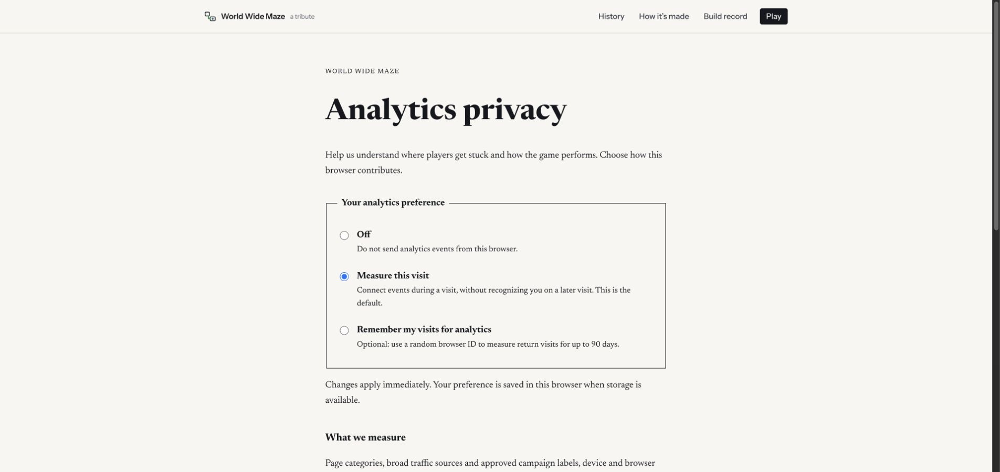

# Analytics browser acceptance — 2026-09-26

Independent QA sub-agent using CUA in dedicated Chrome tabs. Browser actions exercised the actual app at `http://localhost:5174/`, backed by the local Worker at port 8790. The Worker forwarded to the configured PostHog US project with `environment=development` and `release=analytics-qa-20260926`.

Evidence source: `/tmp/wwm-analytics-worker.log`, structured `telemetry_debug` records and `telemetry_delivery` receipts. The parent agent independently owns PostHog UI readback; this report's provider evidence is successful HTTP delivery, not a claim about dashboard queries or production deployment.

## Results

| Check | Result and evidence |
| --- | --- |
| Website navigation | Home → About → home produced normalized page categories and visit continuity. No arbitrary paths were forwarded. |
| Pairing and controller fallback | Host pairing connected to a separate controller tab. Controller reported `connecting`, `enable`, `requesting`, `no-sensor`; the desktop host offered keyboard recovery. Host and controller events used distinct visit IDs and `surface` values. |
| Build failure and recovery | A synthetic localhost URL with path and email markers was rejected with `URL_FORBIDDEN`; practice fallback emitted `stage_selected`, `build_started`, `stage_loaded` and `played`. Measured build duration: 2,422 ms. |
| Pause/resume | Exactly one `played` event across the original play, pause, resume and second pause. Play deltas were 4,302 ms and 4,626 ms; paused engagement records had `play_ms=0`. |
| Restart and exit | Retry emitted `stage_restarted` and a new build attempt. Navigating away emitted final engagement and `page_left`. |
| Payload privacy | No submitted URL marker, synthetic email, room code or pairing credential occurred in the inspected sanitized records. Controller route was the label `controller`. |
| Optional browser identity | A visitor ID appeared only after choosing “Remember my visits for analytics.” |
| Opt-out | Off remained selected after navigating home, clicking Start and returning to privacy. The event count stayed exactly 93 throughout those interactions. |
| Restored baseline | “Measure this visit” restored; subsequent `page_viewed` used visit identity without a visitor ID. |
| Provider acceptance | At baseline restoration: 94 sanitized events, 26 delivery batches, all 26 successful. At final focused readback: 114 records and 38/38 successful batches. Counts are snapshots of a live development receiver. |

## Receipt references (UTC)

- Original host visit: `8f6058f6-cb02-447e-aab4-39b389345810`.
- Controller visit: `83391259-832c-436d-9cd2-fc3f0ada87ce`.
- Initial home `page_viewed`: `cbf75cb3-050a-4c1b-8840-75b51a1c893c`, received 18:13:50.351.
- Rejected URL attempt: `ac90022d-2ca9-435a-a673-ef0a551e2142`.
- First practice attempt: `1683ee96-6f62-48c7-9c01-72e2af0576d5`.
- Restored visit-only privacy `page_viewed`: `6a25854b-203e-4bdd-bca5-e182e9a6335f`, visit `61691276-08b9-4344-8638-64f4a6844327`, received 18:16:45.879.

## Finding fixed and rechecked

The initial development run exposed duplicated `title` and initial `game_phase` events during React StrictMode remount. The parent deferred observer attachment to skip the discarded mount.

A fresh QA load after that change produced exactly **one `title` and one initial `game_phase`** for visit `0c2773d7-75a2-48fb-9cf1-f18c50feeecb`:

- `title` event `c4db0e11-70ea-4143-8c5e-0dc215d5c614`.
- `game_phase` event `87ab5547-9183-4c7f-a825-b748644385fe`.
- Both received at 18:18:52.271; phase attempt `39275a60-ea72-43bd-969d-d168014cf84b`.

## Automated coverage and limits

The independent suite passed **20 tests** across `telemetry.test.ts`, `engagement.test.ts` and `telemetry-posthog.test.ts`. Coverage includes DNT/GPC, unavailable storage, opt-out queue disposal, retry UUID reuse, idle/hidden timing and suspension caps, identity expiry, schema scrubbing and exact PostHog host restrictions.

No physical phone tilt, full stage completion, next-stage progression, or production deployment was manually validated in this pass. DNT/GPC and precise hidden/idle duration behavior were tested with deterministic unit tests rather than modifying the user's browser privacy settings. Historical QA records include the pre-fix StrictMode duplicates; filter development data from product reporting.

## Final privacy screen

Captured through CUA after restoring the default visit preference:

