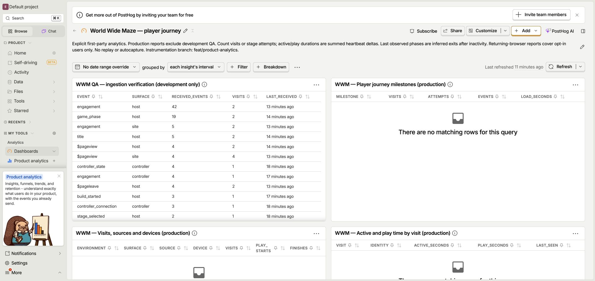

# PostHog report manifest

Verified through the authenticated PostHog UI on 2026-09-26. Project: **260845**, US region. All reports below were created as SQL insights, attached, and read back from [World Wide Maze — player journey](https://us.posthog.com/project/260845/dashboard/2139055).

Seven product reports explicitly filter `environment='production'`; the separate QA tile explicitly uses development data. Production reports currently contain no events because this branch has not been deployed. Queries cover the last 30 days and use their own date range.

| Report | Source | Saved insight |
| --- | --- | --- |
| Ordered first-play funnel | [funnel.sql](funnel.sql) | [QRCLd7cK](https://us.posthog.com/project/260845/insights/QRCLd7cK) |
| Player journey milestones | [journey.sql](journey.sql) | [52gXUvrI](https://us.posthog.com/project/260845/insights/52gXUvrI) |
| Visits, sources and devices | [visits.sql](visits.sql) | [X224JMGm](https://us.posthog.com/project/260845/insights/X224JMGm) |
| Active and play time by visit | [engagement.sql](engagement.sql) | [3SmqxUyI](https://us.posthog.com/project/260845/insights/3SmqxUyI) |
| Last phase before leaving | [exits.sql](exits.sql) | [DS6Dburb](https://us.posthog.com/project/260845/insights/DS6Dburb) |
| Stage outcomes | [outcomes.sql](outcomes.sql) | [81bQLsdK](https://us.posthog.com/project/260845/insights/81bQLsdK) |
| Returning players, opt-in only | [returns.sql](returns.sql) | [tyLCaMah](https://us.posthog.com/project/260845/insights/tyLCaMah) |
| QA ingestion verification — development only | [qa.sql](qa.sql) | [McYqz6Nw](https://us.posthog.com/project/260845/insights/McYqz6Nw) |

## Executed-query evidence

Each of the seven source queries was run in the SQL editor with only the environment literal changed to `development`, then its original production query was run and saved. All parsed and executed successfully; no SQL changes were necessary.

| Development query | Observed result |
| --- | --- |
| Funnel | **2 visits → 1 stage loaded → 1 played → 0 finished**. |
| Journey | 11 milestone rows. Includes 3 build attempts, 2 stage loads, 1 play, 1 rejected build, 1 restart; average stage load 2.31 seconds. |
| Visits | 5 grouped rows covering host, controller and site surfaces; desktop Chrome QA. |
| Engagement | 2 host visits. Exercised visit: **112.608 active seconds, 8.928 play seconds**. Fresh title-only visit: 30.063 active seconds, 0 play seconds. |
| Exits | 0 rows: these visits had not passed the query's 30-minute inactivity threshold. Query execution validated; positive inferred-exit output not observed. |
| Outcomes | `practice`: **1 started, 0 finished, 0 game over, 0 timed out**. |
| Returns | 0 rows: the opt-in identity check occurred on the privacy page; this report filters host events. Positive multi-visit retention output not observed. |

Original production queries returned 0 rows, except the aggregate funnel, which returned one row with four zeros. After attaching all reports, the dashboard DOM listed all eight saved tiles, including the separate development QA table with real stored events.

## Exact provider persistence check

A direct SQL query selected `uuid`, `event`, `timestamp` and `properties.visit` for the two UUIDs from the final StrictMode fix check. PostHog returned exactly these two stored rows:

| Event | UUID | Visit |
| --- | --- | --- |
| `game_phase` | `87ab5547-9183-4c7f-a825-b748644385fe` | `0c2773d7-75a2-48fb-9cf1-f18c50feeecb` |
| `title` | `c4db0e11-70ea-4143-8c5e-0dc215d5c614` | `0c2773d7-75a2-48fb-9cf1-f18c50feeecb` |

Query ID: `83c1ae7d-d927-4a27-945d-bc41b76c56c7`. Provider display: **September 26, 2026, 11:18:47 AM** in the local Pacific timezone. The client timestamp is 18:18:47.431 UTC; the Worker received/logged the batch at 18:18:52.271 UTC. The five-second difference reflects batching and does not indicate missing provider data.

## Interpretation

- The funnel compares the **first occurrence** of each milestone within a visit, requiring pageview → loaded → played → finished order. It permits keyboard and deep-link entry without requiring Start or pairing. It is a visit funnel, not an attempt completion rate.
- Journey milestone counts are independent counts and include errors and retries. Use the ordered funnel for sequential conversion and outcomes for attempt completion.
- Active/play durations sum non-overlapping client deltas. They are observed foreground engagement estimates, not precise wall-clock session length.
- Source and surface groups can overlap within a visit; do not sum grouped unique-visit counts into a total. Controller visits are labeled separately from host visits.
- Last phase is an **inferred** stopping point after inactivity. Closing a browser does not guarantee a final event arrives.
- Returning-player reports apply only to users who choose persistent browser identity. They do not measure cross-device identity or the whole audience's retention.
- QA data contains initial pre-fix StrictMode duplicates. Production reports exclude all development QA.

