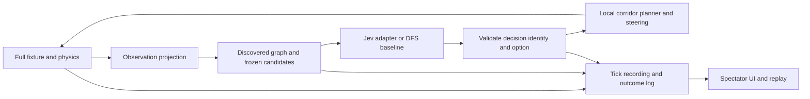

# Jev maze spectator — execution plan

Status: APPROVED — local implementation in progress.

## 1. Approval boundary and repository baseline

The user requested an isolated worktree, an execution plan, an independent system-design review, revision of the plan, and then a stop for their review and sign-off. This document authorizes no implementation, provider calls, credential changes, deployment, or publication by itself. Plan approval will authorize only the local pilot described below; public release requires a separate decision.

- Worktree: `/Users/ewj/.codex/worktrees/jev-spectator-plan/wwm`
- Branch: `codex/jev-spectator-plan`
- Base: `0a0b941f45f709c378f00ad1f6adaa42a827b5c9`, the committed state of `feat/phase-23-lesson-limits` inspected September 26, 2026.
- The original checkout has independent uncommitted overview, extension-release, and Race planning changes. They were not copied, edited, or treated as implemented dependencies.
- No dependency installation, build, live provider call, or game test has been performed for this planning task. Repository evidence below is source inspection, not fresh runtime acceptance.

## 2. Proposed outcome and decisions for sign-off

A viewer opens **Watch Jev**, selects a curated maze, and watches a ball explore it using the real WWM physics. At each island boundary, Jev chooses an adjacent connection using only its discovered map. A local pilot executes that choice. The viewer can pause, advance one decision, inspect the actual choices, and replay the run.

Confirmed follow-up requirement: keep track of every Jev run and every decision Jev makes, including retries, failed and interrupted runs, and returned choices that were never executed. This expands the pilot from replaying recent runs to a durable, browsable local run archive.

The strongest initial purpose is an inspectable experiment: understand what Jev decided and whether it helped. Completing a maze does not by itself demonstrate an advantage over a conventional algorithm.

Approval of this plan accepts these proposed defaults:

| Decision | Proposed first version |
| --- | --- |
| Control | Jev chooses one adjacent connection; deterministic local steering executes it |
| Information | Island-based limited visibility, with persistent discovered graph and traversal history |
| Objective | Reach the goal; no collectible optimization |
| Timing | Physics pauses at decision boundaries while waiting for the provider; separate active simulation and decision-wait clocks |
| Content | One small curated branching maze first; three frozen fixtures for the evaluation pilot |
| Surface | Local `/dev/jev` route; no changes to the public home screen initially |
| Comparison | Deterministic depth-first exploration under identical observations and steering assistance |
| Provider | Direct TypeSafe API through dev-only Node middleware in Vite, credentials only on the server |
| History | Persistent local archive of every started run and all observed decisions/attempts, with searchable run history and a decision inspector |
| Scope | Local demonstration and measured pilot; public launch, direct steering, multiplayer, and Race integration deferred |

These are proposals, not answers silently inferred from the earlier unanswered mode question. The user may change them at sign-off. No new product-wide design system or general AI chat interface is needed for this pilot.

## 3. Evidence and existing seams

All local paths below are relative to this worktree.

| Inspected source | Existing behavior | Planned reuse / gap |
| --- | --- | --- |
| `packages/solver/src/solve.ts` | Headless whole-stage solve, retries and recovery; returns inputs and metrics | Baseline physics knowledge; cannot be relabeled as live Jev play |
| `packages/solver/src/plan.ts` | A* route, speed profile, optional explicit destination; defaults to global goal when omitted | Reuse only with explicit local destination and an enforced corridor mask; no default-goal path in Jev control |
| `packages/solver/src/pilot.ts` | `steer`, tracking state, bounded phone-equivalent tilt | Extract/reuse incremental steering with narrow exports; current package index does not export all tracking helpers |
| `packages/physics/src/replay.ts` | Fixed-tick input replay, goal events, automatic lost/reset handling | Foundation for a separately versioned spectator recording; resets and control changes need explicit semantics |
| `apps/web/src/game/sim-driver.ts` | Free-running worker and deterministic lockstep drivers; no per-step callback for arrival detection | Reference only: dedicated spectator tick driver calls `Simulation.step` and observes each result before another step |
| `packages/engine/src/index.ts` | Existing renderer/camera APIs | Reuse renderer; one engine and one simulation per mounted spectator session |
| `apps/web/src/ui/Play.tsx`, `game.css` | Existing bright, chamfered WWM HUD and ghost controls | Preserve visual identity; spectator overlays live in their own scoped surface |
| `apps/web/src/routes.tsx` | Lazy game/page/dev routes; dev routes omitted from production | Add one isolated lazy dev route |
| `apps/worker/src/router.ts`, `security.ts`, `limiter.ts` | Production API and time-window limiter; no whole-pilot durable attempt ledger | Leave unchanged for local pilot; public API integration is a later release decision |
| `apps/web/vite.config.ts` | Existing dev server binds all interfaces and permits a tunnel host | Dedicated Jev launcher must override to loopback, strict port, no tunnel hosts, and dev-only middleware |
| `packages/ai/src/index.ts` | Scaffold only | Prefer explicit `packages/maze-agent` domain package rather than pretending an AI integration exists |
| `packages/stage-builder/src/maze.ts` | DFS spanning tree; optional easy-mode loops | Branch choice matters under limited visibility; no claimed benefit from choosing an already-solved route |

Official references checked during planning:

- [TypeSafe introduction](https://docs.typesafe.ai/introduction): typed decision outputs rather than generated explanations.
- [TypeSafe HTTP API](https://docs.typesafe.ai/api): `POST https://api.typesafe.ai/v1/systemone`, bearer authentication, state/questions, returned model, answers, and usage.
- [Choice](https://docs.typesafe.ai/primitives/choice): discrete options and probability output. Record requested and returned model identity; revalidate a supported concrete model in M0.
- [Cloudflare secrets](https://developers.cloudflare.com/workers/configuration/secrets/): evaluated for the initial Worker proposal. The reviewed pilot uses a local Node adapter instead; provider credentials still stay out of frontend variables and committed configuration.

API availability, credentials, actual latency, cost, and maze performance remain unverified. Revalidate the response schema and available model before the first approved live test.

## 4. Viewer experience and UI contract

The maze and ball remain the primary content. Reuse the current white background, WWM colors, Figtree/Unbounded typography, and cut-corner control plates. Use a desktop side panel and a collapsible mobile bottom panel. Do not obscure the ball or duplicate the full HUD from Original mode.

1. **Ready:** fixed fixture selector, Jev/baseline selector, short explanation of the steering assistance, provider availability, and Start. Offline scripted examples are named Scripted demo.
2. **Watching:** Follow/Overview camera, Pause, Next decision, Restart, and Exit; compact current-island/current-action display. No phone pairing required.
3. **Decision boundary:** display discovered connections, visits, selection, provider-reported confidence, and measured latency. The world freezes; caption says Waiting for Jev. A small discovered-map view identifies exactly what the selector knows. The spectator may see the full world; label that it exceeds Jev's observation.
4. **Executing:** highlight the selected connection and label Local steering. A concise factual caption such as “Selected east connection; visited once” is derived from records. Do not fabricate thoughts, rationales, or claim that confidence is probability of completing the maze.
5. **Paused/stepping:** Next decision executes at most one selected action and stops at the next frozen observation. A second click while stepping cannot enqueue work. Pausing during a request invalidates that pending result; resuming creates a fresh decision attempt at the same physical state.
6. **Error/unavailable:** frozen world, preserved recording, explicit retry or end. Missing key, timeout, invalid response, quota, and controller failure have distinct messages. No automatic substitution of the baseline under a Jev label.
7. **Finished:** outcome, active time, wait time, decisions, repeated edge traversals, falls, request count, returned usage, and recorded-model identity; replay/export/restart actions. If cost cannot be calculated from a verified rate, show unknown rather than zero.
8. **Run history:** accessible from Ready, Watching and Finished. List every started run with date/time, fixture, model/policy, outcome, decision/attempt counts, duration, and persistence/replay status. Search by run ID and filter by fixture, model, status or date; use pagination, not only a latest-20 list. Open a run to inspect its chronological decision trail and replay available portions. Distinguish successful, failed, stopped, interrupted, unavailable and capped runs. No automatic removal of older runs.
9. **Decision inspector:** each entry shows what Jev was given, every available option in original order, its returned choice/distribution/confidence, request timing and usage, validation status, whether the choice was applied, and the resulting movement/outcome. Expand retries separately under the same decision point; show discarded late choices and cancelled/unknown attempts. Forced/controller actions are visibly separate from Jev decisions. Previous runs open read-only.
10. **Replay:** no provider requests. Timeline jumps to recorded decisions by resetting and deterministically replaying from tick zero; clearly label Recorded run. No resuming a live policy from a replay cursor in v1.

Keyboard-accessible buttons, visible focus, useful labels, restrained live-region announcements at decision boundaries, and reduced-motion behavior are required. Touch controls must remain usable at a 390 px viewport. Reuse en/ja conventions for product-facing strings. Human takeover is deferred to avoid implying that mixed human/agent runs are pure Jev evaluations.

## 5. System boundaries

### Package and file ownership during later implementation

| Responsibility | Proposed files | Owner role |
| --- | --- | --- |
| Pure domain contracts, observations, policy inputs, baseline, recorder | `packages/maze-agent/src/*`, package metadata | Domain implementer |
| Narrow solver integration and corridor support | `packages/solver/src/{index,plan,pilot}.ts` plus focused tests | Physics/controller implementer |
| Session, dedicated tick driver, rendering adapter, run history/decision inspector UI, local cache and replay | `apps/web/src/jev/*`, one entry in `routes.tsx`, dependency entry | Spectator implementer |
| Dev-only provider middleware, launcher, durable run archive/history API, persistent attempt ledger and usage limits | `tools/jev-runtime/*`, opt-in registration in `apps/web/vite.config.ts`, root dev command | Provider/runtime implementer |
| Curated stages and evaluation harness | `fixtures/jev/*`, `tools/jev-eval/*` | Evaluation implementer |
| Evidence and acceptance | `docs/build-log/jev-spectator.md` | Integrator/reviewer |

One integrator owns shared route/package/config changes. The new runtime uses Node built-ins and imports pure contracts from `@wwm/maze-agent`; the provider module must never enter a browser import graph. These are responsibility boundaries, not instructions to launch parallel implementation before approval. Keep Original game, learning runtime, Race plans, ranking API, and score eligibility unchanged. No global state-machine rewrite.

### Observation policy: `island-local-v1`

- On spawn or arrival, discover the current island and its incident connection entrances. Record local compass direction, local bridge class, whether the connection was traversed, and known destination only after it has been visited.
- Reveal goal presence only on the current island. Do not provide global goal coordinates/distance, global node count, seed, solved route, solver cost-to-go, or hidden destination attributes.
- Use run-local opaque node/edge identifiers; generation order and original IDs must not hint at the goal. Stable observation identities must survive replay.
- Supply the discovered graph and bounded traversal history to both selectors. Candidate order derives only from observed local descriptors plus a separately supplied ordering seed, never the stage hash, generation seed, or hidden original IDs. The order is deterministic for that run and shared across policies; evaluation varies ordering independently of geometry.
- When no goal is visible, candidates are all supported adjacent traversals, including the return connection. A single legal choice is recorded as `forced` and does not call Jev. Zero choices terminates as `no-legal-action`. Once the current island reveals a goal, issue the deterministic `finish-visible-goal` action, recorded as `forced-goal`, using its now-observed local goal position. This goal action has priority over adjacent exploration. Reaching the goal island is not success; only the actual physics `goal` event completes the run.
- Physics/pilot may access collision geometry for the selected adjacent corridor. Their output must not select a different connection, reveal hidden route scores, or use global goal-seeking recovery. Same privileges and settings apply to both policies.
- Test the information boundary by changing hidden topology/goal while preserving the observed neighborhood: canonical model-facing `state` and `questions` bytes, local aliases and candidate order must remain identical up to the first new observation. Transport run IDs, fixture hashes, attempt IDs and timestamps are excluded from that equality and are never sent to Jev as model context. Test the actual adapter payload, not just the observation constructor.

### Runtime contracts (new, to be implemented)

| Contract | Required fields / invariants |
| --- | --- |
| `RunManifest` | Schema, fixture content hash, physics/controller/observation/prompt versions, requested and returned model, policy kind, ordering seed, limits, created time; no secrets |
| `Observation` | Run ID, epoch, decision ID, sim tick, discovered graph, visits and bounded history, local status; no full `StageData` reference |
| `CandidateSet` | Version, stable option IDs, local traversal descriptors, canonical hash; generated before policy call |
| `DecisionRequest` | Manifest reference, observation hash, candidate hash, decision ID, attempt ID, bounded observation/candidates |
| `DecisionReceipt` | Matching identity/hash fields, policy provenance, chosen option, original validated distribution/confidence, latency, usage/model, status; provider request ID when available; returned/accepted/rejected/discarded/applied statuses represented as append-only events, never overwritten |
| `RunJournal` | Durable run-created record and append-only sequenced run/decision/attempt/application/outcome events; UTC timestamps plus monotonic durations and simulation ticks; reconstructible summary/index, confirmed recording prefix, interruption/completeness flags |
| `ActionResult` | Decision/option ID, start/end ticks, arrival/fall/stuck/goal status and concrete events |
| `DecisionFrame` | Immutable complete observation and candidate snapshots, canonical hashes, policy/model-facing payload version, decision-boundary state/event digest, and tick; retained for forced moves and errors too |
| `RunRecording` | Manifest, stage hash/reference, initial-state digest, per-tick inputs, full ordered physics event stream, ordered control/UI metadata, complete decision frames/receipts/action results, final state/event digest, outcome and completion/truncation flags |

Keep provider metadata separate from model-facing observation. Validate JSON at server ingress, provider response, UI receipt, and recording import. Hash canonical serialized content, not property-insertion order. Confidence is displayed as provider-reported, never used as a guarantee. No confidence threshold is needed to execute a valid, bounded toy-maze choice in v1.

## 6. Simulation, asynchronous decisions, and replay

Proposed states: `loading → ready → observing → deciding → executing → observing`; terminal `finished`, `failed`, `stopped`; explicit paused state preserving the prior phase; separate replay mode.

- One monotonic simulation tick and one exclusive input owner. Build `apps/web/src/jev/tick-driver.ts` around the existing `Simulation` interface, with a callback receiving the complete `SimStepResult` immediately after each `sim.step`. That callback may halt the accumulator loop before another tick. The original `LockstepDriver` is not suitable unchanged because it exposes no after-step arrival hook. Keep it and the Original game untouched. Use an incremental pilot; never call blocking whole-stage `solveStage` inside the render loop.
- Tick contract: initial loaded state is tick 0; `inputs[0]` drives transition 0→1. Process all events from step n, evaluate termination/arrival, compute a digest, freeze if necessary, and only then permit step n+1. Decisions observed at state tick n first affect `inputs[n]`, consumed by step n+1. Every control event has a monotonically increasing sequence number to order events sharing the same tick.
- Acquire tick-zero ball state through a read-only accessor after `sim.load`, exposing the existing simulation state getter through the narrow main-thread interface if necessary; no dummy physics step. Initial observation is taken at the authored safe spawn, with zero consumed inputs.
- Terminal precedence after collecting every event from a completed step: `fell` means failed even if `goal` also appears; otherwise `goal` means success; otherwise action/run deadlines mean failure; otherwise arrival may open the next observation. Arrival alone never overrides a terminal event. Stop on `fell`, without waiting for `lost` or applying an automatic reset.
- Freeze after processing all events for the current tick before building the next observation. Do not advance the simulation during provider wait, manual pause, or a hidden tab. Discard wall-clock accumulation on resume so there is no catch-up burst.
- Only one provider request can be outstanding per session. Every restart, exit, fixture change, pause, visibility pause, or disposal increments an epoch and aborts the request. Apply responses only if epoch, run, decision, observation hash and candidate hash still match the deciding state. Aborting does not imply the provider avoided billing.
- Low-level path planning must use an explicit adjacent destination and a graph mask restricting it to current island, selected connection, and destination arrival region. `planRoute` currently defaults to the goal: the new adapter must prohibit that omission. Verify every path cell stays inside the allowed corridor.
- Initial fixtures use flat/ramped bridges, without elevators, jumps, portals, learning locks, or overlapping decks. Select a safe arrival anchor per island. Proposed versioned arrival rule: ball within 0.15 m of anchor, horizontal speed ≤0.1 m/s for 0.2 active seconds, on the expected island. On the tick that satisfies this rule, halt further steps and capture the next observation. The `finish-visible-goal` path is restricted to the current island and ends only on the `goal` event, without waiting for anchor settling. Ordinary travel uses an explicit zero terminal-speed path profile instead of `DEFAULT_TUNING.goalSpeed=2.5`. Add an arrival phase that requests zero desired speed (the existing `steer` accepts `speedScale=0` and then opposes measured velocity); if drift leaves the anchor tolerance, use bounded low-speed recentering inside the same corridor, then resume zero-speed settling. All braking/recentering inputs are ordinary recorded physics inputs. No velocity teleport or unrecorded reset is allowed. M1 must verify that this actually settles on safe flat anchors; tuning creates a new controller version before evaluation.
- No silent rescue route. A fall ends the pilot run as failure, preserving inputs/events; no respawn in v1. A stuck action ends after 10 active simulation seconds with less than 0.1 m advancement along its local path, with a hard 30 active-second action deadline. Record these thresholds in the controller version. Exploration revisits are allowed, bounded by overall limits.
- Record every input actually consumed by `sim.step`, not one input per render frame. Record pause/resume, cancellations and end reason with tick plus wall-clock offsets. Restart creates a new run, never an in-place reset inside an existing recording.
- Replay re-simulates only consumed inputs through the same dedicated tick driver, regenerates physics events, and compares them with the saved full ordered physics event stream; never inject saved physics events into the simulation or renderer a second time. Only non-physics UI/control metadata is replayed as metadata. Provider wait is represented on the timeline, not extra physics steps. Stop at first fall/goal consistently. Replays cannot write scores or start inference. At each decision tick compare canonical digests of ball position/velocity, supported dynamic state, and ordered physics event prefix with the original run, using the recorded build and exact numeric serialization. M1 must expose the required simulation-state fields if the public result omits them; do not hash renderer interpolation. Historical panels read saved `DecisionFrame` snapshots, never reconstruct choices from the current policy. A mismatch disables motion replay and is visible as incompatible/corrupt replay, while saved observations, choices and summary remain inspectable as unverified historical records. This claims reproducible visible state/events, not a serialized snapshot of all Rapier internals.
- An empty run has a valid initial-state recording and outcome; do not send zero inputs through the existing `runInputs` path that throws on empty input.
- The authoritative history is the local filesystem archive in §7. IndexedDB is only a disposable recent-replay cache (proposed 20-run / 50 MiB cap); cache eviction never removes archive records. Export is available from history for every run. Cap each recording export/import at 10 MiB (within the 50 MiB aggregate cap), validate version and bounds, reject unknown fixture hashes, and render strings as text. Track serialized recording size while running; before exceeding the cap, stop with `recording-limit`, preserve a complete prefix and mark the run incomplete. Acceptance includes a maximum-duration/high-decision export/import round trip. Import validation must bound decoded arrays/strings as well as file bytes. If browser caching fails, history still reads the archive. If authoritative persistence fails, freeze the run, show the last confirmed saved tick and offer an emergency export of the unsaved buffer; do not continue making decisions as though tracking succeeded. Do not send full recordings to analytics.

## 7. Provider boundary, local scope, and limits

Proposed endpoint: `POST /api/jev/decide`, implemented as **dev-only Node middleware** registered by a dedicated `pnpm dev:jev` launcher. It runs in the Vite development server process and intercepts `/api/jev/*` before the existing `/api` Worker proxy. The existing Worker and production configuration remain unchanged. No new cloud storage or remote resource is needed.

### Launch, authentication and privacy

- The launcher requires an explicit local pilot ID and opens `local/jev/<pilotId>/` under the worktree (ignored by Git). It acquires an exclusive filesystem process lock before serving. A second process refuses to start against that ledger. A stale lock requires an explicit recovery command that checks the owning process is gone; never silently erase a ledger or reset its count.
- Only this launcher sets `WWM_JEV_PILOT=1`. It configures Vite to bind `127.0.0.1`, uses a strict chosen port, and removes the existing tunnel-host allowance. Refuse startup if these properties cannot be enforced. Standard `pnpm dev`, Vite preview, and production builds do not install the middleware.
- Use an exact configured browser origin such as `http://127.0.0.1:5173`. Middleware checks socket loopback address, Host, and same-origin Fetch Metadata. Mutating requests also require matching Origin, JSON Content-Type, and a random per-launch session token in a custom header. Never trust forwarded headers to bypass these checks. No CORS allowlist or preflight grants to foreign origins.
- A same-origin browser fetch to `/api/jev/session` obtains the short-lived per-launch token; this bootstrap requires exact Host and same-origin Fetch Metadata and sends `Cache-Control: no-store`. Keep the token in browser memory, never in a URL or recording. Headless evaluation runs obtain the token through the local harness, with an explicit authenticated path covered by tests. Restart invalidates all old tokens. This boundary is for an operator's trusted local machine, not a multi-user production service.
- The provider key is supplied only to the Node process environment (or a specifically loaded ignored server-only local file), never via a `VITE_` variable, frontend bundle, or bootstrap response. Do not install dependencies or configure secrets during planning.
- Server fixes the provider host, question text, supported model, and schema. Send only curated maze observations: no page text, screenshot, private URLs, or unrelated user data. Metadata is outside model context. Reject arbitrary prompt/model/URL overrides.

### Complete run and decision archive

The local runtime owns `local/jev/<pilotId>/runs/<runId>/` with a versioned manifest, append-only `journal.ndjson`, bounded request/response evidence files, and sequenced recording chunks. A rebuildable index supports history browsing. Use server-generated IDs and resolve files through the validated index; no client-supplied filesystem paths. The archive is outside Vite's public directory, ignored by Git, and served only through authenticated, same-origin local APIs. Explicitly deny the archive and ledger through Vite filesystem serving (`/@fs/`), raw imports, root/static routes, and symlink aliases in both standard dev and the dedicated launcher. Register the denial independently of the opt-in API middleware; test direct unauthenticated URL and encoded/traversal variants. Build and preview must contain no archive assets. Being outside `public/` alone does not establish this boundary.

- **Every run:** persist a `run-created` record before leaving Ready or consuming any input. Include runs with missing credentials, startup errors, manual stops, no provider calls, failures and recording/budget limits. Restart creates a new run linked by `parentRunId`; it does not overwrite the earlier attempt. Store fixture/configuration hashes, requested/returned model identities, start/end timestamps, policy, limits, outcome and completeness. Baseline and scripted runs follow the same format with distinct provenance.
- **Every decision point:** durably save its immutable `DecisionFrame`, ordered candidates and exact canonical model-facing `state`/`questions`, with schema/prompt versions, before dispatch. Retain complete history even though model input uses only bounded traversal history. A hash alone is insufficient for inspection.
- **Every provider attempt and observed answer:** link reservation, dispatch intent, returned bounded response, validated receipt or validation error, and discard/application status by decision ID and unique attempt ID. Persist the actual application payload and bounded response body after credential redaction; do not replace the original response with a UI summary. Malformed/oversized responses retain a bounded diagnostic prefix and explicit truncation/validation status. Oversized responses are never executable decisions.
- **Durability before action:** fsync the request/frame and reservation before dispatch; fsync a returned response/receipt before replying to the browser. Before consuming the first input of a selected or forced action, the browser appends and obtains acknowledgement for an `action-start-authorized` event. After movement, persist its result and the complete consumed-input/event chunk through that boundary before any next decision/forced action. An authorization event means execution was permitted, not proof it occurred; only subsequent recorded inputs/outcomes prove execution. Storage failure freezes the simulation and refuses new inference/actions.
- **Cancellation and late results:** the server owns the bounded provider operation after reservation even if the browser disconnects. It persists any response it actually receives within the five-second deadline, with the browser's cancelled/obsolete epoch so it cannot move the ball. Log late/discarded answers as such. If the server dies or the provider outcome cannot be observed, keep `outcome-unknown`; never invent a choice, zero usage or a completed action. All returned responses received by the functioning runtime are retained before they can be applied; remote outcomes never delivered cannot be recovered or promised.
- **During motion and on restart:** flush ordered input/event chunks at least every one active simulation second and at each decision/terminal boundary. Acknowledge each chunk with its last persisted tick; deduplicate by run ID, chunk sequence and content hash. Bound the pending buffer to one second and freeze if the next flush cannot be acknowledged. Browser/server crashes may lose an unacknowledged movement suffix, which is explicitly marked incomplete; the already-durable decision record remains. Process-start recovery marks prior-process nonterminal runs `interrupted` with the last confirmed contiguous tick. Merely opening history, a second tab, or a read API never changes the status of a live run; ownership and browser reconnection follow the rule below. Do not auto-resume an interrupted run; a new run can link to it.
- **Evidence commit and crash recovery:** give every frame, request, response and chunk a deterministic run/attempt/sequence identity plus content hash. Write each bounded immutable artifact to a same-directory temporary file, fsync it, atomically rename to its final identity, and fsync the directory before appending/fsyncing the journal reference. Only then acknowledge it. The journal is authoritative for lifecycle transitions; immutable files are recoverable evidence even if their reference append was interrupted. On process-start recovery, scan validated evidence identities and reconcile missing references idempotently before rebuilding the index or serving mutating requests. Preserve conflicting/corrupt artifacts for inspection and refuse further run mutation; never overwrite them or redispatch a reserved attempt. A durable response file without a journal reference must appear as a recovered answer, not `outcome-unknown`. A valid orphan input chunk may extend the confirmed replay prefix only when sequence, previous hash and tick ranges are contiguous; a gap remains an explicit incomplete suffix. An acknowledgement lost in transit can be retried with the same identity/hash without duplication. Torn journal tails retain their valid prefix and require explicit recorded recovery; do not silently drop evidence. If a response was received only into volatile memory and the process died before durable write, its unavailable choice remains `outcome-unknown`; “all observed answers” cannot promise survival of that uncommitted crash window. Crash injection tests cover each write/flush/reference/ack boundary.
- **Run ownership and reconnection:** the runtime issues a separate run-owner capability at create time, stores only its hash outside exported evidence, and binds mutations to that owner and process epoch. The creator keeps it in tab-scoped sessionStorage for ownership recovery and also registers a fresh per-document ID; history readers never receive the capability. A full page refresh/new document cannot resume the prior simulation: an authenticated owner-recovery request marks the old run interrupted and opens its preserved evidence, with an option to start a new linked run. The sessionStorage capability alone does not prove that the simulation still exists. Temporary transport reconnection by the same still-live document may resume its retained simulation within a proposed 30-second wall-clock lease only after owner/process/document identity validation and acknowledgement/reconciliation of outstanding chunks; remain paused until explicit resume. If identity or the consumed-input prefix is uncertain, mark interrupted instead. This adds no live-policy restoration from a replay cursor. While active, owner heartbeats renew the lease; loss expires the run as interrupted, stops new actions/dispatch and invalidates the capability. An acknowledged deliberate pause suspends expiry while the runtime is alive, preserving hidden-tab pause semantics; explicit stop/exit or process restart closes it. A paused run whose owner is lost can be explicitly marked interrupted by the operator; viewing it cannot do that. Run-owner capabilities are not provider credentials and must be omitted from logs, exports, URLs and the journal. A response that arrives after interruption appends a received-but-unapplied event to the old run and updates evidence/accounting only; it never resurrects the run or authorizes motion. A history tab may inspect that late arrival while the terminal outcome remains interrupted.
- **History API:** authenticated local endpoints create runs, append idempotent events/chunks, list/filter/paginate summaries, and read/export one run's details. Server validates event transitions and identities and computes summaries from the journal. All APIs use the existing §7 origin/token/path/size checks. Read-only history works without a provider key and does not consume inference budget. Reconstruct a missing index from journals; preserve a readable prefix and flag a corrupt journal rather than silently declaring the run complete.
- **Retention:** retain the whole pilot archive until the user explicitly removes it. Never rotate/delete run history automatically and never use the browser cache cap as a retention policy. Proposed archive cap is 512 MiB per pilot and 32 MiB per run, including decision evidence and up to 10 MiB of input replay. Reserve capacity for the bounded response and terminal metadata before each provider call; if insufficient, record `archive-limit` and block new work instead of losing earlier decisions. Keep a small reserved metadata allowance for closing existing runs. The UI offers export and capacity information; creating another pilot or raising the cap is an explicit operator choice.
- **Exports:** per-run JSON/NDJSON evidence plus replay recording, and a pilot summary CSV with run IDs linking to full evidence. Exports retain exact observed option values and lifecycle statuses. No credentials, authorization headers or session tokens; no generated internal reasoning. CSV cells beginning with spreadsheet formula characters must be escaped. Export/import replay limits in §6 are distinct from full evidence-archive export size.

The primary completeness measures are created runs recorded, decision points recorded, provider attempts accounted for, observed answers preserved, and executed actions linked to receipts. Report unknown provider outcomes, missing movement suffixes, truncated invalid responses and unsaved buffers separately. “All decisions” means every answer actually observed by this system, with explicit uncertainty where a crash/network boundary prevents observation.

### Durable local attempt accounting

- One active decision attempt across the pilot process; reject overlapping dispatch with a retryable busy result, without automatically retrying it. Every actual provider dispatch first appends a reservation to `attempts.ndjson` and flushes it to disk with `fsync`. Serialize reserve/dispatch bookkeeping. If durable reservation fails, do not call the provider.
- The pilot-wide budget ledger and per-run journal are linked by immutable attempt IDs. The budget reservation is authoritative for spending: a crash between ledger and journal writes leaves a counted unresolved reservation, reconciled into the run journal on recovery. Do not claim a cross-file transaction or redispatch it. Ledger records are append-only with sequence, pilot/run/decision/attempt IDs, payload hash and status; result records append usage, model, status and sanitized response metadata. The server restores counters from all reservations at startup. No automatic expiration or refunds for failed, timed-out, cancelled, or unknown outcomes. An incomplete/corrupt ledger fails closed pending explicit recovery.
- Deduplicate by pilot/run/epoch/decision/attempt ID and payload hash. A completed duplicate returns the recorded receipt without a new call; an in-flight duplicate is busy; an unknown post-crash reservation remains counted and is not redispatched. A mismatched hash under the same identity is rejected. A manual retry uses a new attempt ID and consumes budget.
- Persist server-issued run IDs and run reservations in the ledger. Enforce 64 provider attempts per run and 600 across the pilot ID server-side; restarting a browser/server does not reset them. Creating a new pilot ID starts a separate experiment and must be deliberate, not an error-recovery default.
- Proposed payload cap 16 KiB, at most 8 options, 32 observed islands, and 256 actions / 300 active simulation seconds per run (forced moves count as actions). Unsupported fixtures are rejected before starting. Five-second provider deadline and no automatic retries. Abort is best effort and does not imply absence of remote work or billing.
- Request caps are not a guaranteed currency ceiling. Before live testing, record current pricing, selected account, and a conservative cost estimate from the configured payload/call bounds. If unavailable, stay in mocked mode and report the live gate. All smoke and retry calls count toward 600; the 9 measured runs allow at most 576, leaving 24 for setup/retries outside those run caps.

### Validation and evidence

Server validates selected option membership, complete finite distribution within range/sum tolerance, confidence bounds, response kind, and model identity. Invalid/missing fields yield an explicit error. Define probability sum tolerance as 1e-4; do not silently renormalize provider data. Preserve the validated original values.

Log only request identities, status, durations and token usage to general logs; never credentials, authorization headers or unfiltered provider errors. Curated observations, exact model-facing payloads and bounded sanitized provider responses must be saved in the authoritative local run archive as specified above. Bound response bodies to 256 KiB and fail explicitly on larger responses. Record unknown usage/cost explicitly. Pin the model for comparisons; if aliases are used, record and partition by actual returned model.

A future public API requires separate identity, persistent shared quotas, abuse controls, retention policy, Worker integration and deployment approval. The local middleware is not that production service.

## 8. Baseline and evaluation design

The reference policy performs graph depth-first exploration: choose the first eligible untraversed edge in the frozen order, retain a node/edge traversal stack, mark visited node identities, and backtrack along the known parent edge when a node has no remaining unexplored options. An edge that discovers an already-visited node is marked as a cycle edge and returned across without pushing a duplicate node frame. Record every such move; cycle handling cannot inspect hidden nodes. Both policies use the same forced finish-visible-goal rule. It receives only `Observation` and `CandidateSet`, with the same movement assistance, limits, and failure rules as Jev. It cannot consult the full map. An omniscient solver may validate fixtures offline, but is separately labeled and excluded from the fair comparison.

- Begin with one 6–10-island fixture containing a genuine fork and dead end, no hazardous mandatory maneuvers. Confirm it is physically traversable before calling Jev.
- Freeze three curated fixtures, each at most 16 islands and 8 local options, including a loop and a revisited junction. Produce manifest hashes before evaluation.
- Run three trials per fixture per policy, matching ordering seeds and settings. This is a 9-run Jev feasibility pilot, not a statistical benchmark. All calls including smoke/retries count toward 600 attempts.
- Report all runs including failed, cancelled, unavailable, and capped runs. Show completion fraction, active/wait/total wall time separately, edge traversals/revisits, falls/controller failures, decisions/forced choices, request errors, latency p50/p95, returned usage, and cost coverage.
- Separate selector errors from controller inability and provider failure. A curated success video must identify its fixture/model and sit alongside the complete result table.
- Functional acceptance does not require beating DFS. If Jev fails to finish most pilot runs or needs excessive repeated choices, deliver the functioning experimental UI with the measured limitation and return for a decision before broadening content or tuning on the evaluation set.
- Keep one additional fixture outside tuning for a later confirmation run. Freeze prompts/controller/settings before the measured pilot; tuning changes create a new evaluation version.

## 9. Execution sequence and acceptance gates

The user authorized all phases in chat; implementation and local validation are now complete, with the repository-wide regression limitations recorded in `plans/evidence/jev-handoff.md`. Estimates are planning ranges for one senior implementer, exclude credential delays, and are not commitments.

| Milestone | Work and ownership | Acceptance evidence | Indicative effort |
| --- | --- | --- | --- |
| M0: freeze contracts | Integrator: reconcile base, record scope choices, confirm provider schema/model/pricing, register the specified local ledger/routing contracts, fixture identity and versions | Written contracts; no unresolved lifecycle or observation-boundary ambiguity | 0.5–1 day |
| M1: incremental controller and archive | Domain/physics/runtime: new package, one fixture, local observation, corridor planner, DFS, fixed-tick stepping, durable journal/chunks and mocked attempt lifecycle | Baseline finishes; run/decision archive survives process restart; same inputs reproduce; hidden-map perturbation test passes; route never exits corridor | 1.5–2.5 days |
| M2: spectator UI | UI: isolated route, renderer lifecycle, ready/watch/pause/step/error/result, camera and discovered map, run history/decision inspector, local replay/cache | Browser walkthrough; one-decision stepping exact across 30/60 Hz and irregular render frames; responsive/accessibility check; no leaks on repeated mount/exit | 1.5–2.5 days |
| M3: Jev adapter | Provider: dev-only middleware/launcher, typed adapter, cancellation/identity, durable local budget ledger, explicit failures | Mocked contract/fault tests pass; key excluded from frontend; standard dev/preview/production lack endpoint, restart preserves counts; then one approved-budget live smoke | 0.5–1 day |
| M4: evaluation and handoff | Evaluation/integrator: frozen fixture manifest, 9 matched trials, evidence report, regression checks | Complete results incl. failures; one live run replay matches; reviewable local demo; remaining limitations explicit | 0.5–1 day |

Estimated total: 4.5–8 focused engineering days, revised to include durable complete run history and its UI. M1 is the principal technical risk; a corridor controller that cannot reliably stop/turn on simple fixtures is a reason to revise the plan before polishing UI or spending provider budget.

### Meaningful verification matrix

| Area | Must verify |
| --- | --- |
| Observation | Hidden goal/topology changes cannot alter model input; opaque IDs and ordering do not encode unseen facts; both selectors receive identical observations at matched states |
| Actions | Selected option maps to exactly one corridor; no global-goal default, jump/elevator escape, or automatic rescue; observed-goal action hits the sensor; invalid option never steps physics |
| Lifecycle | Pause during request/movement, restart, fixture change, exit/unmount and hidden-tab return; delayed/duplicate receipts never move a later run; one outstanding request |
| Replay | Goal, failed fall, manual stop, empty recording, pauses, provider errors; inputs/events/final state match in the same physics version; incompatible imports rejected |
| History and durability | Every started run remains listed after more than 20 runs/cache eviction; restart/refresh and missing index; all retries and discarded answers inspectable; crash before/after reservation/response/action acknowledgement/chunk flush and artifact/journal/index commit boundaries; orphan response/chunk reconciliation, second-tab inspection, owner refresh/lease expiry and late answers after interruption; late result after disconnect; disk full/corrupt log; no new inference/action without durable evidence; export redacts secrets/capabilities; unauthenticated Vite filesystem/raw/static access blocked; unknown outcomes and incomplete suffixes remain explicit |
| Provider | Missing key, disabled route, bad origin/token, oversized body, invalid probabilities, wrong model/choice, timeout, quota and exhausted budgets; bounded retries and usage receipts; simultaneous tabs, ledger fsync failure/corruption, process restart, unknown reservation, duplicate request, ordinary dev/preview exclusion and foreign-origin bootstrap rejection |
| UI | Desktop and 390 px mobile; keyboard and reduced motion; ball visible with panel expanded; live/scripted/baseline/replay attribution; persistence failure |
| Regression | Original practice and fixture play, phone route lazy-loading boundary, current ghost toggle/replay, learning gate route behavior, production build excludes dev spectator entry |

After implementation, use existing `pnpm check` and `pnpm --filter @wwm/web build`; add and run focused domain/controller/provider/browser cases using existing Vitest/Playwright conventions. Do not assume new project names or scripts exist until registered. Record pre-existing failures separately with baseline reproduction where needed. A passing typecheck is not live-provider or visual acceptance.

## 10. Rollout, rollback, and delivery

First delivery is local and opt-in. A saved recording remains reviewable without a provider key. No production deploy, remote secret upload, score submission, public link, or remote persistence is part of this plan.

Rollback: stop the dedicated dev launcher and disable the local feature environment, cancel active requests, dispose simulation/renderer resources, and preserve recordings for export. Shared solver changes require regression evidence and can be reverted independently; the existing game must not depend on the new package to play. Avoid automatic data deletion on disable.

Implementation handoff must include commands to launch the local demo, exact tested commit/model/fixture hashes, recordings and complete evaluation table, checks and screenshots, remaining defects, and a separate proposal if public release is wanted.

## 11. Review and sign-off

Independent system-design review is saved to `plans/reviews/jev-spectator-system-design.md`. All four findings (JEV-SD-01 through JEV-SD-04) are resolved in this plan: goal completion, per-step lifecycle, local provider/ledger scope, and historical decision replay. The independent reviewer confirmed readiness for user review; the findings and dispositions are recorded there. Reviewer approval means the plan is ready for the user to assess; it never authorizes implementation.

Run-history addendum: the user explicitly requested tracking each run and all Jev decisions. The independent reviewer confirmed all three additional findings (JEV-SD-05 through JEV-SD-07) resolved: crash evidence recovery, run ownership/reconnection, and authenticated-only archive access. The updated plan was reviewed before the user subsequently authorized execution.

User approval: **APPROVED** in chat: “execute on the plan in the worktree and start the server so i can test it out once its ready”. Local implementation and server startup authorized; public deployment remains out of scope.

## 12. Implementation decisions and acceptance record

Implemented in `codex/jev-spectator-plan`. See `plans/evidence/jev-handoff.md` and the full measured table in `plans/evidence/jev-evaluation/pilot.json`.

The implementation uses one inline, append-only, fsynced `journal.ndjson` per run: evidence and its lifecycle reference are the same record, eliminating the separate artifact/reference orphan window. The independent system-design reviewer accepted this simplification, conditioned on complete writes and failure latching. Writes loop until all bytes are written; new-file and new-run directory entries are fsynced; uncertain write/fsync errors disable further mutation until restart/recovery. The separate attempts ledger remains authoritative for spending, with orphan reservations reconciled as unknown. Torn final records require the explicit `pnpm jev:recover <pilot-id> --confirm` command, which preserves the original damaged bytes. Interior corruption fails closed. This replaces the multi-file artifact commit protocol above; it does not promise recovery of a response that never reached durable storage.

The authoritative archive directly powers history and replay. An additional IndexedDB cache was omitted: browser cache eviction cannot affect retention, and every retained run is readable from the local archive. Imported JSON recordings are read-only and do not create provider calls or overwrite the archive. Per-run JSON contains evidence and replay chunks; summary CSV includes run IDs, which link back to full history. Recording limits, fixture/physics identity, per-chunk digests, event checks, and replay prefix continuity are validated.

The frozen pilot ran headlessly through the exact local API, observations, selector adapter, corridor controller, and fixed-step physics used by the UI. Rendering was intentionally omitted for throughput. `activeSeconds` measures simulation time; `executionWallMs` is headless execution time and must not be presented as real-time watch duration. The browser walkthrough separately verified watching, pause, one-decision stepping, resume, replay and responsive layout. Ordering seeds 0 and 2 share the same ordering under the frozen parity-based ordering policy; these are repeated trials, not three distinct ordering permutations. The fourth fixture was used for controller validation only, never for Jev tuning or measured selection trials.

M1–M3 functional acceptance passed. M4 measured result: 9/9 Jev and 9/9 baseline completions across the three fixtures; all 18 final-state replays matched. Live smoke also completed and matched replay. This is a feasibility result, not a statistical model-ranking claim. The initial concurrent full-suite invocation failed; all 10 failed files subsequently passed in focused/serial reruns. See the handoff for exact results. Public rollout remains out of scope.
