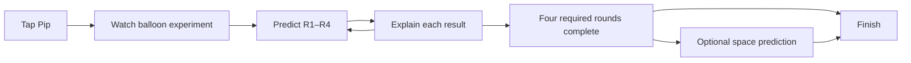

# Pip’s Rocket Lab — integration execution plan

**Status:** Implemented for local review; automated gates passed. Local final checks passed, including all five built Rocket browser cases. Review PR and exact-candidate CI are the current delivery step. Production release remains gated.
**Prepared:** September 30, 2026. Source audit: local HEAD `008c1407dce4`.
**Audience:** Ages 4–6, English, parent-guided.
**Scope:** One lesson in the standalone education app and the WWM maze, using the same content, renderer, demonstrations, answers and hint ladder.

The first reviewable deliverable is a balloon demonstration followed by two opposite-direction predictions in the standalone lesson. The final deliverable adds the tied balloon, upright rocket, optional space example, Pip’s voice and four reliable maze checkpoints. On September 30, Eric authorized updating and committing this plan, executing it, testing, delivering screenshots and opening a review PR. Merge, production release and child/device acceptance remain later gates. Paid narration uses the existing bounded generation path only after a reviewed dry run and provider allowance; it must not block a locally testable review candidate.

## 1. Intended experience and scope

The child watches gas leave an opening and the balloon move the other way, makes a prediction, then sees the experiment explain the result. Turning the opening around changes the next prediction. The learning goal is **“Gas goes one way. The rocket gets pushed the other way.”** A 2–4 minute lesson is a design target to test, not an established duration or learning outcome.

- Keep Pip, large illustrated choices, replay, gentle feedback, three levels of help and a satisfying finish.
- Four required rounds; the fifth is a skippable bonus. The child can point or tap without reading, naming left and right, dragging precisely or answering quickly.
- Teach through a short demonstration, prediction and explanation. Maze travel connects checkpoints; navigation skill is not evidence of science understanding.
- Use the existing game overlay for questions. Animate trusted 2D vector scenes rather than adding a rocket vehicle, thrust physics, fuel inventory or a new 3D world.
- Deliver a portable learning HTML file that the game can load through its bounded, inert JSON reader.
- Keep the other nine concept lessons in review. Preserve the six-activity `little-discoveries` path, its saved family versions and the separate experimental `maze-discoveries` contract.
- First release has no learner account, recording, new analytics, localization or durable lesson resume. A new run starts the lesson again; explain that behavior consistently with existing guided lessons.

**Content source:** [Rocket Lab review pack](../docs/education/lesson-concepts/2026-09-30/lessons/rockets/README.md), [authored questions](../docs/education/lesson-concepts/2026-09-30/lessons/rockets/lesson.json), and its five `round-*.svg` references. The review gallery proves those static scenes and answers correspond; it does not prove the future animation, game integration, narration or learning effectiveness.

## 2. Lesson sequence to implement

| Step | Question or action | Scene and accepted prediction | Explanation and completion rule |
| --- | --- | --- | --- |
| Introduction | Tap Pip, then watch a short balloon experiment | Level string; opening and illustrated air move right while balloon moves left | Explain that the pale puffs show invisible air. Complete the demonstration before enabling round 1. Replay is always available. |
| R1 — Balloon | Air exits toward the yellow triangle. Which marker will the balloon move toward? | Circle left, triangle right; opening right; answer **blue circle** | Gas right, balloon left. Correct prediction followed by a finite experiment and feedback. |
| R2 — Reverse | Pip turns the balloon around. Which marker will it move toward now? | Same marker positions; opening left; answer **yellow triangle** | Only opening orientation needs to change. Avoid changing balloon color as an extra clue in the shipped version. |
| R3 — Tied shut | No air escapes. Will the initially still balloon zoom along the level string or stay here? | Visible knot, no exhaust; answer **stay here** | Inflation alone is not propulsion. Help can compare a separately labeled open balloon with the tied one. |
| R4 — Rocket | Hot gas shoots down. Which way does this initially still rocket start moving? | Star above, flower below; answer **up toward the star** | Show enough thrust to rise; plume never touches the ground or flower. Completes the four required rounds. |
| R5 — Optional space | Gas goes toward the circle. Which way can the initially still rocket move in space? | Circle left, triangle right; exhaust left; answer **yellow triangle**; third option “cannot move” | Expelling its own gas gives the push. No surrounding air or surface. “Finish” remains available without attempting the bonus. |
| Finish | Pip celebrates and offers replay or a grown-up activity | Required progress is 4/4 regardless of bonus choice | Invite an adult-run balloon-and-string experiment. No proficiency score or speed reward. |

### Presentation rules

1. Every prediction starts from rest. The string is level and guides the balloon; the upright rocket is a simplified launch with sufficient thrust. Do not imply this model predicts the total travel direction of an already moving spacecraft.
2. Keep direction markers fixed and use shape plus color. Scene descriptions, choices, spoken labels and answer IDs must describe the same orientation.
3. During an unanswered prediction, show the opening and gas-exit representation, but keep the vehicle still. No motion arrow or correct-choice highlight appears before help or an answer explanation.
4. Help advances from **find the opening → slow experiment → worked explanation with opposing arrows**. Automatic help after mistakes may use the same ladder; it must visibly count as help, rather than appearing in the unassisted scene.
5. A wrong prediction costs no life, gem, time or score. Offer explanation and another attempt; do not repeatedly play a full sequence on rapid taps.
6. Correct feedback demonstrates why the choice works. Explanation completion and “Continue” are separate from answer acceptance; both must be safe to replay or interrupt.
7. Reduced motion uses clearly labeled before/after frames and the same spoken explanation. It still teaches the relationship without requiring continuous motion.

The balloon experiment and reversal are grounded in [NASA JPL’s Simple Rocket Science](https://www.jpl.nasa.gov/edu/resources/lesson-plan/simple-rocket-science/). Expelling hot gas provides rocket thrust, including in vacuum, as described by [NASA Glenn’s Rocket Thrust](https://www1.grc.nasa.gov/beginners-guide-to-aeronautics/rocket-thrust/). Both sources were rechecked September 30, 2026. They support the science; they do not validate this short lesson for every 4–6-year-old.

## 3. Current integration seams

These findings are verified from the local checkout, not from production.

| Area | Current behavior | Required change |
| --- | --- | --- |
| [Stable schema](../packages/learning/src/schema.ts) | `wwm-learning/0.3`; `choose`, `compare`, `difference`; math/token scenes | Add a separately versioned guided science contract and a bounded motion-prediction scene. Keep existing readers and saved documents compatible. |
| [Experimental contract](../packages/learning/src/lesson-v04.ts) | `0.4` describes Bridge Builders, inventory and resume | Preserve its branch. Rocket Lab is a guided lesson, not an inventory/deposit encounter. |
| [Session](../packages/learning/src/session.ts), [presentation](../packages/learning/src/present.ts), [script](../packages/learning/src/script.ts) | Intro enters a question directly; several non-`choose` branches assume gem islands; choices can shuffle | Add an explicit teaching-demonstration lifecycle. Make round dispatch exhaustive. Keep Rocket scenes and choices unshuffled initially. |
| [Scene](../packages/learning/src/scene.ts), [checkpoint](../packages/learning/src/checkpoint.ts) | Shared trusted vector renderer, with token or gem scenes | Add a shared Rocket scene and finite explanation timeline; return correctly ordered semantic choices to both consumers. |
| [Education generation](../apps/education/scripts/generate.ts), [Vite inputs](../apps/education/vite.config.ts) | Both enumerate only `baselinePath` | Generate and build Rocket Lab explicitly, alongside the existing pages. Adding a generated HTML file alone will not include it in the build. |
| [Education runtime](../apps/education/src/lesson.ts), [rendering](../apps/education/src/render.ts), [storage](../apps/education/src/storage.ts) | Reads stable documents and applies the baseline family fork/settings | Dispatch by validated guided format. Do not apply a six-introduction family draft or reject saved baseline settings against the Rocket path. |
| [Game loader](../apps/web/src/learning/load.ts) | `?learn=` resolves the baseline; file loader reads stable HTML; three round kinds accepted | Resolve a curated catalog, recognize the new document and reject missing capabilities before loading a level. |
| [Gates](../apps/web/src/learning/gates.ts), [levels](../apps/web/src/learning/levels.ts) | Gate-specific `play` can bypass intro; `finishStep` may omit required rounds absent from a level | Require the introductory demonstration on every first-entry route. Keep all four required Rocket rounds reachable; no early completion. |
| [Gate card](../apps/web/src/learning/LearningGateCard.tsx) | Shared question overlay with gem-oriented effects | Dispatch the Rocket demonstration and explanation lifecycle, retaining physics/timer pause while the card is open. |
| [Voice tool](../tools/learning-voice/src/cli.ts) | Generates the baseline script into one manifest; dry run default | Add an explicit path selector and Rocket manifest without overwriting baseline coverage. Runtime continues to use authored clips and configured origins. |

## 4. Contract and architecture decisions

The names below are **proposed implementation contracts**, not existing APIs. Freeze them at M0 before parallel implementation.

### A. A separate curated lesson and a new guided document version

- Activity ID: **`rocket-lab`**; title: **Pip’s Rocket Lab**. Map the concept pack’s `rockets` ID once in authored content, not through a runtime alias on every request.
- Path ID: **`pip-discoveries`**, initially containing only Rocket Lab. Its catalog entry links to the lesson; it does not alter the six existing baseline activities or advertise the other nine concepts as playable.
- Proposed format: **`wwm-learning/0.5`**, for a bounded extension of guided lessons. Keep the current `0.1–0.3` parse/upgrade behavior and the separate `0.4` Bridge Builders branch intact. Do not relabel `0.3` documents or expand the Bridge Builders schema to contain unrelated lessons.
- Use a common internal guided-session model for validated legacy and new guided documents. Reuse baseline theme, level and input primitives; explicit format dispatch owns serialization and parsing. The normalized document union distinguishes legacy guided, `0.4` encounters and new guided science, so consumers cannot accidentally pass an inventory encounter into the guided renderer.
- New round kind: **`predict-motion`**; new activity domain: **`physical-science`**. Declare required capabilities for motion prediction, Rocket scenes and the introductory demonstration. Capability checks happen before selecting a level or constructing a renderer.
- Public routes: **`/education/lessons/rocket-lab/`** for the standalone lesson and **`/play/practice?learn=rocket-lab`** in the game. Education remains a separate Vite app, built with `/education/` as its public base and copied into `apps/web/dist/education` before the existing Worker asset upload. Preview and production therefore publish the same two-app artifact, with no new host or service. Update generated navigation/download URLs and Vite base together; do not overwrite the game's root `index.html`. A Rocket portable HTML export must load through the file chooser and produce the same lesson.
- Keep the current 200,000-byte JSON and 12,000-byte theme bounds, strict unknown-field rejection, unique IDs and exactly one inert `script#wwm-learning[type=application/json]`. Escape JSON delimiters on export. No raw SVG, executable timelines, arbitrary URLs or imported code in the document.

**Concrete shared API ownership:** `schema.ts` retains the strict legacy `pathSchema` and legacy `parseLearningPath`/read/write APIs, which continue rejecting new round kinds in a `0.3` document. Shared runtime `Round`, `Activity` and `LearningPath` types become explicit unions supporting validated guided science. Add `guided-v05.ts` for public guided parse/read/write and capability APIs (implementation may keep primitive schemas in `schema.ts` to avoid circular imports), `motion.ts` for bounded scene truth, `rocket-lab.ts` for canonical content/catalog selection, and `motion-effects.ts` for the finite browser controller. Both apps use the new guided reader/serializer at their entry boundary; baseline family draft APIs stay legacy-only. Extend `NormalizedLearningDocument` with a distinct `guided-v05` branch; never normalize `0.4` encounters into a guided path.

The minimal `0.5` fixture contains `format`, path ID/revision, English age/review metadata, the existing theme and optional voice block, `shuffle: none`, required capabilities `round.predict-motion`, `scene.rocket-lab`, `demo.rocket-push`, and a physical-science activity. Its rounds contain bounded scene enums, semantic options, authored prompt/hints/success and a derived-answer consistency check. Each consumer validates all declared capabilities before constructing state. Include valid Rocket, contradictory-answer, unknown-capability, legacy-format-with-motion and escaped-export fixtures in M1.

### B. One validated scene drives the answer, explanation and drawing

Model only the cases needed here: balloon on a level string, upright rocket and rocket in space. Use finite enums for apparatus, setting, opening/exhaust direction and initial rest condition. A tied balloon has no exhaust and no initial propulsion; an open balloon has horizontal exhaust. The upright rocket expels gas down; the space example expels gas horizontally.

Choice records use semantic IDs such as `circle`, `triangle`, `stay`, `zoom`, `star`, `flower`, `cannot-move`, and a bounded predicted-motion value. Derive expected starting motion from the scene. Validation requires exactly one matching choice and rejects contradictory answer, opening or setting combinations. The worked explanation uses that same derived result. Authored prose remains subject to science review; a type checker cannot prove a sentence is accurate.

Use trusted balloon, knot, straw, string, rocket and exhaust drawing functions. The review SVGs guide the renderer’s geometry and correspondence tests; do not load their markup from a supplied HTML file. Decorative concept art is optional, optimized and bundled by the app; it is never the source of instructional orientation or answer logic.

Set Rocket’s scene and answer order to `shuffle: none` for the first release. Alternate accepted choices through R1–R5 as authored. Later variants may rotate or reverse a complete scene, prompt, voice and answer mapping together, after separate tests; generic option shuffling must never scramble spatial meaning.

### C. Demonstrations are finite session effects

Add an introductory demonstration state plus explicit started/completed/canceled effect handling. A first entry through `start`, a gate’s `play(roundId)` or the HUD fallback must all honor that prerequisite. Requesting R3 first cannot bypass the introductory experiment or count R1/R2 as solved.

Suggested flow:



The shared package supplies a deterministic timeline and a small browser effect controller used by both apps. Gas and body movement overlap, so the picture shows the push relationship. Use a finite duration around 3–5 seconds as an initial visual target, adjustable after narration and child review. Avoid an open-ended particle simulation.

- Each effect has a session/generation token. Stale completion callbacks cannot advance a new round or unlock a bridge.
- Replay restarts the current explanation; it never adds progress. Correct answers lock once. During an effect, duplicate choice input is ignored.
- Backgrounding, route departure, restart and disposal cancel timers/frames and voice. On return, replay the interrupted demonstration from its start; never silently mark it watched.
- Audio can coordinate emphasis through bounded cues, but the visual sequence does not depend on `speechSynthesis` word-boundary support. Clip failure, mute and silent mode retain the same teaching frames and usable controls.
- Neutral choice callouts may highlight each option in turn; only worked help or feedback highlights the accepted answer.
- Extend explicit round dispatch in session, presentation, scripts, scene, checkpoint and both app renderers. Audit every `kind !== 'choose'` and default branch that currently assumes `islands` or `stimulus`.

**State/commit contract:** introductory `demonstrating` must complete before a prediction. A correct answer enters `explaining`: record the accepted choice once, hold required progress and maze lock completion until the finite explanation completes, then enter `ready-to-continue` (represented by a solved round plus no pending effect). `next`, keyboard confirm, `proceed` and `rollOn` are ignored while the required effect is pending. A deliberate Later/close cancels playback and retains the pending explanation; reopening replays it without another answer or progress increment. Effect completion carries its generation token and can commit only the matching pending effect. Hints may run demonstrations without committing a correct answer. Reduced motion completes through equivalent before/after frames; mute or audio failure never leaves a pending effect dependent on provider callbacks. Restart resets accepted answers, effects and progress.

### D. Maze progress remains complete and understandable

Recommend the existing guided/gated style: four required question steps, path/goal locks where the stage can support them, and a grown-up override. No fuel pickups or science missions in this release.

- Start with an authored fixture that has four reachable checkpoint positions. Use the existing engine-neutral world binding and overlay; leave persisted `StageData` and ranked scoring unchanged.
- A smaller stage keeps the complete required-round queue. Missing physical checkpoints are offered through the existing Pip/HUD fallback as sequential questions. Final goal completion remains blocked until R1–R4 are solved, unless the grown-up explicitly overrides.
- If the adapter cannot provide reachable required questions or required lock behavior, reject that Rocket configuration with a clear explanation. Do not silently substitute an explore level, omit a round or change the lesson’s quantities/content.
- Reopening a solved gate can replay its explanation without unlocking twice. Leaving an unanswered card keeps that round pending.
- Keep maze simulation and timer paused during teaching, questions and explanations. Continue releases input at a neutral boundary before resuming movement.
- R5 uses the bonus offer after required progress; it creates no mandatory path lock. Skipping it completes normally.
- A grown-up override permits navigation and is visibly distinguished from completing all four science predictions. Falls, gems and time never become science mastery metrics.

**Sparse-stage completion ownership:** update `apps/web/src/learning/locks.ts` and `gates.ts` under a Rocket completion policy. Current binding changes a no-spot step to `lock: none`; current `#maybeOpenGoal` filters `b.goal && b.spot`, excluding fallback questions. For Rocket, create a finish lock whenever any required round remains, even with zero physical spots, and compute its waiting set from all four required round IDs and committed explanations rather than placed gates. The HUD's `#unplacedRound` queue remains reachable from the start and after each question. Update goal-lock owner/banner lookup to name the earliest pending fallback round. Leave legacy explore, missions and their binding behavior unchanged. Test zero-post, one-post, out-of-order gate visits, explicit override and all-four completion; assert goal lock state before/after every answer and explanation, not only the final card.

### E. Family data and audio remain bounded

Do not apply `wwm-learning:family-fork:v1` to `pip-discoveries`; its draft schema promises exactly six baseline introductions. Preserve that key and `wwm-learning:settings:v1`. Rocket starts with its authored introduction and recommended level. If Rocket preferences need persistence, use a separate path-scoped key and bounded validation; do not overwrite or reinterpret baseline records. Existing mute preferences can remain shared.

Reuse Pip’s configured voice and content-hashed audio origin. Extend the build-time CLI with a path selector and separate Rocket manifest. Include introduction, air-visibility explanation, demonstration, prompts, neutral choice labels, every hint, success, bonus, finale and interruption/control lines in coverage. Deduplicate exact existing lines where safe. Imported documents never select a provider, voice URL or remote asset.

Dry-run output must show changed lines, missing clips and cumulative character count before any generation. Retain the existing `WWM_VOICE_MAX_CHARACTERS` limit and no ambiguous paid-request retries; that application limit is not an invoice ceiling. Paid generation and publication are a later execution step subject to the agreed provider allowance. CI and runtime never generate speech or send child answers to a voice provider.

## 5. Milestones, owners and exit gates

Owners are responsibilities for the future implementation, not agents dispatched by this planning task. One engineer can own several roles. If parallel work is used, shared contract/session files have one owner; app workers begin only after the contract and scene API are frozen.

| Milestone | Owner | Depends on | Reviewable output and exit gate |
| --- | --- | --- | --- |
| M0 — Freeze content and interfaces | Integration lead + content/science reviewer | This plan | Five-round content map, scene/answer invariants, document and effect contracts, fixture choice, support matrix; **G0** |
| M1 — Balloon vertical slice | Shared learning engineer + education engineer | M0 | Intro experiment, R1/R2, hints and replay in a hidden standalone preview, with parser/export tests; **G1** |
| M2 — Complete standalone lesson | Education engineer + shared learning engineer | M1 | R3/R4/R5, finish, catalog/build/export and accessible responsive experience; **G2** |
| M3 — Maze integration | Game engineer | M1 contracts; M2 content | Four reachable required gates, sparse-stage fallback, correct locks and optional bonus; **G3** |
| M4 — Voice and acceptance | Voice/content owner + QA; Eric or available device/tester operator | M2 + M3; narration copy frozen | Reviewed clips, automated regression, performance comparison, real-device checks and observed child session; **G4** |
| M5 — Release and readback | Integration/release owner | G4 | Exact-candidate CI, preview evidence, controlled enablement, production smoke and rollback receipt; **G5** |

**Critical path:** M0 → M1 → M2/M3 → M4 → M5. Voice tooling can proceed after M0; paid clip generation waits for final copy. Device access and child review are M4 dependencies; they do not block the initial slice. Track implementation time separately from review/device scheduling, and estimate remaining work after G1 exposes the actual shared-type changes.

### M0 tasks and G0

1. Recheck checkout and deployment state separately. Use an isolated implementation worktree if the checkout is shared or contains unrelated changes. Preserve the untracked concept pack and capture its source revision with the implementation handoff.
2. Freeze stable IDs, format dispatch, normalized guided types, scene validation, semantic choices and finite effect API. Write representative valid and invalid fixtures before widening consumers.
3. Trim spoken sentences into short segments without losing “starts still,” “level string,” or the gas/body relationship. Retain circle/triangle markers, tied-balloon R3 and optional space R5 as the default content decisions.
4. Specify the four-post fixture and a zero/one-post sparse fixture. Confirm first-entry routes, gate fallback, completion behavior and restart semantics.
5. Record desktop, iOS Safari and Android Chrome support targets with available physical device/operator details. Capture a same-fixture Gems baseline for later performance comparison.

**G0:** A content reviewer can trace every accepted answer to the scene rule; engineers can implement both consumers from the same written API. Unknown device access and learning evidence remain explicitly pending. No remaining design question blocks the balloon slice.

### M1 tasks and G1

1. Add the strict new guided format, round schema, capability checks, canonical content module and catalog resolver behind a disabled Rocket feature switch.
2. Implement shared scene rendering, finite effect timelines, introductory prerequisite, answer/continuation states and the motion-specific hint ladder.
3. Update session, script and presentation dispatch. Keep current baseline round behavior and migrations covered by existing regression tests.
4. Connect intro, R1 and R2 to a hidden education preview. Test normal, muted and reduced-motion modes, replay, rapid input and interrupted demonstrations.
5. Export the slice as inert learning HTML and parse it back. Invalid scene combinations and unsupported formats must fail clearly.

**G1:** The reviewer can see air leave right while the balloon moves left, then turn the opening around and obtain the reverse result. R1/R2 choices and narration match the picture across layouts and seeds. No progress occurs merely from watching or replaying. Existing Gems tests still pass. The incomplete slice remains absent from public navigation.

### M2 tasks and G2

1. Author R3–R5 and their comparison/transfer explanations using the same scene contract. Derive truth from validated scene data and preserve four required rounds.
2. Add the Rocket route to generation **and** Vite multi-page inputs. Add a separate curated catalog link and a finish link back to the appropriate collection; avoid changing “six stops” baseline copy to imply seven personalized lessons.
3. Adapt `render.ts` round summaries, answer labels, scene blocks and portable export. Include static before/after teaching frames in the portable file so its readable version explains the mechanism without scripts or remote media.
4. Route storage/family handling by path. Verify a saved baseline family version remains readable before and after opening Rocket Lab.
5. Fit the question, diagram, choices, feedback and essential controls on small screens. Keep actual button hit areas at least 44 CSS pixels, keyboard focus visible, labels meaningful and essential markers distinguishable without color.
6. Provide replay, mute, help, bonus skip, finish and restart. Correct feedback completes once, and the end card offers the adult-run physical experiment.

**G2:** A complete standalone run works by tap and keyboard, in wide/tall layouts, reduced motion and audio-failure modes. Every required question appears; both bonus paths finish. Portable HTML round-trips and loads in the new reader. Old exports and saved family data pass regression checks.

### M3 tasks and G3

1. Extend the bundled loader and file loader to the curated Rocket path. Declare supported round/scene/demo capabilities explicitly; reject unsupported requirements before level fallback.
2. Wire shared scenes/effects into `LearningGateCard`; add an explicit demonstration gate mode where needed. Ensure intro cannot be bypassed by gate-specific `play` or HUD entry.
3. Bind R1–R4 to the four-post fixture. Add the complete pending-round fallback for sparse stages; audit `finishStep` so the Rocket run cannot finish with required rounds unasked.
4. Preserve lock idempotence, gate replay, wrong-answer retry, override, input cancellation and paused simulation/timer behavior. Cancel effects on exit, reset and stage lifecycle changes.
5. Offer R5 after required completion, then show a clear “lesson complete” result distinct from maze score. Keep learning runs unranked and ordinary stage/race behavior unchanged.

**G3:** Real game E2E reaches a gate with the marble, teaches before asking, rejects a wrong answer, explains a correct one and opens only the intended lock. Four-post and sparse fixtures both require all four predictions. Bonus skip, replay, exit/reentry, override and restart have consistent outcomes. Imported Rocket HTML produces the same experience as the bundled route.

### M4 tasks and G4

1. Extend voice tooling and run a non-spending dry run. Review the final script and character estimate before using the existing bounded paid generation path. Verify the selected manifest, hash/text correspondence, remote clip existence and representative playback.
2. Listen to all authored lines with their scenes: pronunciation of Pip, pace, gas versus vehicle direction, circle/triangle names and optional space explanation. Check clip, browser-speech and silent fallback; automated silent tests alone do not accept narration.
3. Complete the test matrix below, then compare the Rocket candidate and Gems baseline on the same fixture, device/browser, renderer and build configuration.
4. Eric or an available operator completes physical desktop/mobile walkthroughs. Record device, OS/browser, build hash and evidence for first-tap audio, portrait/landscape, browser chrome, pause/background, replay and finish. Emulation does not replace physical Safari/Chrome audio acceptance.
5. Observe a parent-guided child session. Note whether the child follows the opening, reverses the prediction, distinguishes tied/open and transfers to the rocket. Use a fresh balloon orientation or pointing task after the lesson so repeating memorized choices is not the only evidence. Do not require verbal explanation to accept a direction response.
6. Record prompts, help used and confusions without child identifiers or recordings. If markers or sentences confuse the child, adjust those first. If the space round distracts from the core relationship, retain it as a later extension rather than blocking the four-round pilot.

**G4:** Automated tests pass, shipped narration is heard and synchronized, and named physical devices complete the flow. Content/science review has no unresolved misleading explanation. An observed child session finds no blocking comprehension/usability defect. A small pilot supports iteration, not a claim of proven mastery or universal age suitability. Missing physical or child evidence remains an explicit release limitation.

### M5 tasks and G5

1. Deliver reviewable PRs in order: hidden shared contract + balloon slice; complete standalone content; game adapter + fallback; reviewed voice/assets + release enablement. Keep intermediate PRs invisible to public navigation. Independent review checks saved artifacts and contract regressions, not only screenshots.
2. Capture exact PR head, local check results, CI status, preview URL and preview smoke. Verify deployment variables rather than assuming previews/production are enabled. The Rocket feature switch must be explicit in both education and web builds.
3. Enable the reviewed pilot only after G4. Identify any remaining review status honestly in parent-facing copy. Merge/deploy follow the authorized release workflow and its approval requirements at execution time.
4. Recheck the exact main-push deployment and public artifact. Smoke the education route, bundled game route and exported/imported file; verify expected clips load from the trusted origin. Confirm baseline paths and family data still work.
5. Save the build log and handoff evidence. Rebuild the docent index after adding a build log if the repository’s generated-corpus check requires it.

**G5:** Production serves the intended build; a real lesson completes through all four required questions, with both bonus paths working. Preview, CI and production evidence are recorded separately. A merged PR without production readback is not completion.

**Review PR boundary:** complete local implementation/browser tests, screenshots and PR preparation without waiting for access to a child or physical devices. Record those unavailable gates as pending, leave production enablement off and label the PR a review candidate. M5 production work follows user review; opening the PR is the authorized endpoint of this execution request.

**Build and release switch:** use `VITE_ROCKET_LAB_ENABLED` (default false) consistently in education generation/runtime and game bundled/file loading. Local review and PR preview builds opt in; production remains explicitly false until acceptance. `pnpm --filter @wwm/web build` must build education and copy its complete output under `dist/education` before deployment. An off build serves a small unavailable Rocket page and rejects Rocket imports while keeping baseline education pages available. Add a built-artifact smoke that loads `/education/lessons/rocket-lab/`, verifies its lesson ID, follows its asset URLs and rejects SPA fallback HTML masquerading as the lesson. A previous artifact rollback reverts both consumers together; no storage or database migration is involved.

## 6. Verification matrix

| Area | Required evidence | Primary owner |
| --- | --- | --- |
| Scene truth | Opening/exhaust direction yields opposite starting motion; tied balloon has no exhaust; space scene requires no surrounding air; answer mapping is unique | Shared learning + science reviewer |
| Document safety | Strict bounds, unique IDs, invalid enums/contradictions, escaped export, exactly one inert JSON block; untrusted markup never enters renderer; unsupported capability rejection | Shared learning |
| Compatibility | `0.1–0.3` fixtures and portable exports retain semantics; `0.4` tests stay green; baseline six-introduction drafts/settings remain usable | Shared learning + education |
| State/effects | Demo prerequisite on all entry paths; replay/duplicate/cancel/stale callbacks cannot solve or unlock; correct answer counts once; four required rounds; bonus skip/accept | Shared learning + game |
| Presentation | Static prediction conceals motion result; hints/explanations reveal at the appropriate time; markers, labels and voice agree; multiple seeds preserve authored spatial meaning | Education + game |
| Maze binding | Four-post and zero/one-post stages preserve all four required questions; fallback reachable; physics/timer pause; correct lock only; override distinct from completion | Game |
| Input/accessibility | Tap, keyboard and assistive button activation; visible focus; no reading prerequisite; shape/color redundancy; reduced-motion sequence; 320/390 px and landscape | UI + QA |
| Audio | Complete Rocket manifest, unchanged baseline coverage, hash/text matching, trusted-origin HEAD verification and actual playback; clip/speech/silent interruption and recovery | Voice + QA |
| Performance | Fixed-size SVG/finite effects; no hidden/unmounted animation work; bounded preload; repeated open/replay/close does not accumulate listeners, nodes or timers | Performance + QA |
| Learning pilot | Observed reversal and transfer attempts, help usage and marker comprehension; no mastery inference from maze score or a handful of correct guesses | Eric/tester operator + content reviewer |
| Release | Exact candidate CI and preview, intended production deploy, route/file/audio smoke and baseline readback; rollback demonstrated | Release owner |

Initial performance acceptance: no new physics/WebGL loop or library for the lesson; at most one active Rocket effect controller; no effect frame work while backgrounded or disposed. Compare repeated gate interaction and frame timing against the baseline, using identical configurations. Investigate any repeatable regression; freeze measured numerical budgets at M0 rather than claiming an unmeasured frame-rate guarantee. Lazy-load optional decorative art and avoid preloading every lesson’s audio from the catalog page.

### Checks to run during implementation

From the repository root, using the pinned pnpm version and Node 24 as in CI:

```sh
# Targeted shared/app/voice tests (add Rocket cases to these projects).
pnpm vitest run --project @wwm/learning --project @wwm/education --project @wwm/web --project @wwm/learning-voice

# Exact candidate checks and builds.
pnpm check
pnpm build:education
pnpm --filter @wwm/web build

# In a separate terminal after the education build:
pnpm --filter @wwm/education preview

# Against that built preview, following the existing CI pattern:
WWM_EDUCATION_E2E_BASE=http://127.0.0.1:4174 pnpm vitest run --project @wwm/education education.e2e
```

Extend `packages/learning/test/learning.test.ts`, `apps/education/test/pages.test.ts`, `apps/education/test/education.e2e.test.ts`, game learning/lock/world tests and `apps/web/test/learning.e2e.test.ts`. Keep the separate Bridge Builders regression. Add focused Rocket modules if the existing tests become unwieldy. Chromium must actually run for browser gates; a locally skipped suite is not a pass. The current game learning E2E deliberately removes speech and aborts audio requests, so keep a separate voiced walkthrough gate.

Proposed CLI commands **after** the path-selector work exists: `pnpm learning:voice --path pip-discoveries` for the dry run, then `--verify` for clip readback. The present CLI has no such selector. Do not copy those flags into a paid command before implementing and testing argument validation and manifest selection.

## 7. Risks, decisions and rollback

| Risk | Planned response | Reconsider the approach when |
| --- | --- | --- |
| New round exposes gem-only assumptions across both apps | Own shared dispatch centrally; prove the balloon slice before expanding all scenes | Compatibility changes become broader than the guided lesson boundary; reduce the internal adapter surface before adding generic features |
| Demo becomes decorative or leaks the answer before a prediction | Distinguish introduction, unanswered scene, requested help and feedback; review rendered states | The child follows highlighted markers rather than the opening; shorten/reframe the prompt and remove incidental clues |
| Marker position, shuffled choice or voice disagrees | Semantic IDs, fixed scene/order, one validated data source and seed tests | Any independent consumer reconstructs direction or answer state |
| Sparse stage silently shortens the lesson | Required-round queue plus reachable HUD fallback; explicit rejection if requirements cannot be honored | A stage permits finish with unsolved required rounds without an explicit override |
| Audio or background transition leaves a stuck demo | Finite controller, cancellation token, replayable interruption and reduced-motion frames | Progress depends on a provider timing event or an unbounded wait |
| Shared storage treats Rocket as the baseline path | Path-aware family handling; separate optional Rocket preferences | Opening Rocket produces a saved-family warning, clears a key or changes baseline settings |
| Scope expands into fuel/flight/orbits or all ten categories | Ship only this prediction lesson using the existing maze overlay | Extra mechanics do not help the child explain the opposite-direction push |

**Default decisions for execution:** circle/triangle markers stay; R3 tied balloon stays; R5 remains optional; first release uses fixed spatial order, one authored English voice, a separate curated path and no Rocket-specific durable learner state. Revisit wording and duration using the M4 observation, without blocking the first slice on optional preferences.

**Release control:** Add one Rocket enablement decision shared by catalog generation and bundled game resolution; keep it disabled during partial implementation. File import separately requires a fully supported parser/renderer and capability validation. A partial client cannot load a document merely because its catalog flag is on.

**Rollback:** Disable Rocket catalog/bundled entry and deploy the last verified build if needed. Direct Rocket URLs show a clear unavailable state instead of loading another lesson. Preserve baseline documents, saved family settings and immutable audio. Imported Rocket documents must either remain fully supported by the shipped adapter or explicitly reject as unavailable; they must not enter a disabled partial runtime. No database migration, persisted stage rewrite or deletion of learner/family data is required.

## 8. Execution handoff and definition of done

The implementation handoff contains this plan, the Rocket concept pack, frozen contract fixtures, the branch/worktree root, scope owners, device/operator availability and a gate checklist. Capture the source pack in the delivery branch before relying on currently untracked files; do not stage unrelated concept outputs incidentally.

The release handoff contains the exact commit/PR, rendered intro and five scene states, portable HTML, script/manifest coverage, test/build results, four-post and sparse-stage walkthroughs, physical-device/audio notes, child pilot observations, deployment readback and rollback receipt. Record each as passed, failed or pending with its evidence location.

**Done means:** Rocket Lab teaches the gas/opposite-push relationship before testing it, presents all four required rounds in both consumers, offers a genuinely optional space round, explains each answer with matching visuals and voice, and ships without breaking existing guided lessons or family data. Local tests, CI, preview, physical acceptance, learning observation and production delivery remain separate evidence gates.


## 9. Execution receipt — September 30, 2026

The hardened plan and Rocket reference pack were committed first as `6dafbe8`. Implementation uses the isolated `codex/pip-rocket-lab` branch in `/Users/ewj/.codex/worktrees/pip-rocket-lab/wwm`, based on current main. The separate mobile-controls PR and the other nine concepts remain outside this branch.

| Gate | Current evidence | Remaining acceptance |
| --- | --- | --- |
| M0 / shared contracts | Strict guided 0.5 reader, bounded motion truth, semantic marker/order validation, explicit capabilities, independent legacy readers | Educator and observed learning review |
| M1 / balloon slice | Mandatory demonstration, R1/R2, replay, hint ladder, tokenized explanation completion | Physical audio/interaction review |
| M2 / standalone | R1–R4 plus optional R5, both bonus paths, keyboard/tap, reduced motion, portable before/after HTML, preserved family keys, compiled `/education/` artifact | Physical iOS Safari / Android Chrome |
| M3 / maze | Four posts on the existing handmade practice fixture; zero/one-post binding tests and a frozen zero-post fixture; finish requires all four; Later/reopen and stale completion cases; portable-file import; real-marble first entry | Physical controller and broader device acceptance |
| M4 / automated | Full local check: 1,624 tests passed; final targeted lock/effect regressions passed; complete built Rocket browser cases and all 19 legacy education browser cases passed | New paid clips, listening review, physical devices, child pilot and measured same-device performance comparison |
| M5 / delivery | Screenshots and implementation prepared for review PR; default/off artifact verified; production flag remains false | Exact-candidate CI; hosted preview unavailable while `WWM_PREVIEWS_ENABLED=false`; merge/release not authorized |

The browser effect now holds its readable after-frame until narration completes, within a bounded fallback window, and cancels frames/timers on hide or disposal. Returning replays interrupted work. Correct answers count and unlock only after the matching explanation completes. Before/after frames serve reduced motion. No lesson physics/WebGL loop or dependency was added. Effect ownership and cancellation have timer tests; this is not a measured physical-device performance certificate.

The initial production-CSP browser run exposed the shared answer hit areas' inline style attributes. They now receive trusted numeric positioning through CSSOM, which also preserves baseline behavior under the same strict policy. Mobile labels use wrapped geometric scene text. Independent finish review requested Rocket-only removal of the game eyebrow and colored explanation side stripe, plus design documentation; those changes were resolved in the finish batch. The final independent review disposition is **ship** for the review interface, with all three findings resolved; release gates remain pending.

Narration dry run: 115 script lines, 82 existing clips reusable, 33 missing lines / 32 unique new clips, 2,140 characters. The operator allowance question is pending; no paid generation was performed. The review build uses browser narration with readable silent fallback. Do not mark complete clip coverage or physical first-tap playback as accepted.

See [implementation and browser evidence](../docs/build-log/pip-rocket-lab.md) and [screenshots](../docs/build-log/assets/rocket-lab/). Local validation used Node 26 and pinned pnpm 11.5; CI uses Node 24.

Review build commands:

```sh
VITE_ROCKET_LAB_ENABLED=true pnpm --filter @wwm/web build
pnpm --filter @wwm/web preview --host 127.0.0.1 --port 4173
WWM_ROCKET_E2E_BASE=http://127.0.0.1:4173 pnpm vitest run --project @wwm/web rocket.e2e
WWM_EDUCATION_E2E_BASE=http://127.0.0.1:4173/education pnpm vitest run --project @wwm/education education.e2e
```
