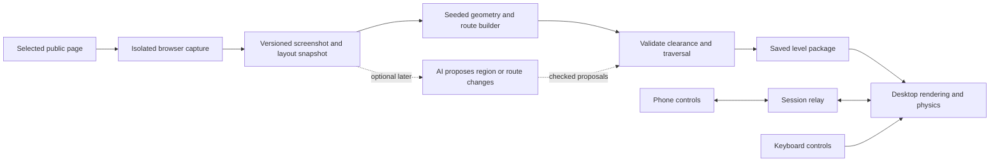

# Proposed recreation and AI showcase

This is a proposed direction, not an approved implementation specification. It assumes a faithful browser revival is the first objective and that AI's contribution should be visible in the development record. Historical evidence is in [the research dossier](world-wide-maze.md).

## The central proposition

**An inventive 2013 web experience, rebuilt with today's AI tools, with enough evidence to see both the original craft and the new work.**

Three deliverables support that proposition: a playable game, a concise history, and an inspectable build record. The game gives people a reason to care; the history credits the originators; the record makes the AI claims assessable.

The main uncertainty is whether the proposed process can preserve the relationship between a recognizable webpage and a satisfying course. A generic maze with webpage colors would not answer that question.

## Where AI belongs

| Approach | What it demonstrates | Principal tradeoff |
|---|---|---|
| Faithful experience, AI-assisted engineering | How current tools help research, implement, debug, and verify a demanding known design | Needs a candid build log; the finished game alone does not reveal AI's contribution |
| AI interprets the page and proposes levels | Whether model judgment improves region selection, routes, or thematic variation | Makes attribution of the original experience less clear; introduces generation failures and cost |
| Faithful mode plus optional AI remix | A direct baseline and a new creative experiment | Nearly two product scopes; establish the baseline first |

Recommendation: begin with the first approach. Treat runtime AI as a later, separately evaluated feature. A reconstruction of a documented project cannot fairly establish how AI compares with inventing that project without a reference.

Record model/tool identifiers, prompts, elapsed time, active human time, available usage costs, failed attempts, manual changes, test evidence, and remaining defects. Avoid an unsupported “AI built this in X minutes” claim that omits research, dependencies, iteration, and review. Original team effort is currently unknown, so a numeric productivity multiplier would be unjustified.

## What fidelity should mean

Define fidelity around observable behavior before implementation:

- A user recognizes the selected page in the resulting world.
- The transition from webpage to playable scene is understandable and satisfying.
- Phone input feels connected to the world; keyboard access is equally discoverable.
- Traversal, jumps, pickups, map inspection, recovery, and finishing form a coherent loop.
- The camera lets the player judge edges and landings.
- Loading, permissions, conversion failure, and connection loss are understandable.
- Original creators are credited, and reconstructed or newly invented details are labeled.

Set exact art targets only after a timestamped review of surviving footage. The archive and related installation provide evidence, but exact launch-era equivalence has not yet been established.

## Proposed architecture

This diagram is a new design recommendation, not a recovered historical architecture.

The level package should be inspectable and playable after capture finishes. Pairing and controller transport should be independent of page generation. This separation lets failures be reproduced with frozen input rather than a changing website.

| Component | Initial candidate | Reason to evaluate it |
|---|---|---|
| Rendering | TypeScript and Three.js | Direct control over geometry, materials, transitions, and camera; [current docs](https://threejs.org/docs/) |
| Physics | Rapier 3D with a fixed simulation step | Browser-compatible WASM option; evaluate slopes, narrow bridges, and moving platforms before adopting; [official guide](https://rapier.rs/docs/user_guides/javascript/getting_started_js/) |
| Capture | Playwright with Chromium | Screenshot capture plus explicit layout observations; [screenshot API](https://playwright.dev/docs/screenshots) |
| Level construction | Deterministic image/layout processing plus graph algorithms | Repeatability and explainable debugging; implementation language follows the prototype |
| Input | Orientation events with calibration; keyboard fallback | Requires device testing and permission handling; [current browser guidance](https://developer.mozilla.org/en-US/docs/Web/API/Device_orientation_events/Detecting_device_orientation) |
| Transport | Small WebSocket relay | Start with a protocol that can be measured and replayed; reconsider transport only if measured latency requires it |
| Preservation | Exportable level JSON, textures, provenance, and versioned settings | A playable fixture should remain useful even if capture or AI providers disappear |

These are candidates, not a benchmark result or pinned dependency plan. Hosting choice can follow the requirements; the original's Google infrastructure is historical context, not a requirement for a new version.

## Geometry and gameplay decisions

For the initial generator, capture a consistent viewport and retain both pixel appearance and visible layout regions. Normalize the page, build candidate surfaces, and record why regions were included or excluded. Keep page content recognizable while enforcing a minimum usable surface size.

Construct a connected graph and select a seeded route. Graph reachability is only the first check: validate bridge width, ball clearance, ramps, elevation changes, guardrail openings, landings, and recovery locations using the actual collision geometry. A mathematically connected graph can still produce an unplayable course.

Prefer a continuous start-to-goal route in the first generated levels. Add optional jump challenges after basic traversal succeeds. Place rewards so they help players read the route without making every region equally busy.

Let the desktop own the live simulation. Send timestamped, sequenced control samples; expire stale input; distinguish jump presses from held tilt state. Pause on connection loss and resume only after fresh input and recalibration when needed. Keep smoothing modest: it should reduce sensor noise without disguising a slow connection.

Modern orientation access requires HTTPS in relevant browsers, and some browsers require a permission request triggered by a user gesture. Design an explicit “Enable tilt” action and test denied permission, rotated screens, backgrounding, and reconnection on physical devices. [MDN orientation guidance](https://developer.mozilla.org/en-US/docs/Web/API/Device_orientation_events/Detecting_device_orientation).

## Scope the website promise honestly

Start with one owned or approved page, then a small fixture set covering article text, a card grid, a dark theme, and a sparse layout. Only expand to user-entered public URLs after those cases produce recognizable and playable results.

A capture service for user-entered URLs needs an isolated browser with resource/time limits and network restrictions, including redirect and subresource checks that prevent private-network access. Keep authenticated pages and personal browsing sessions outside the initial scope. Sites that cannot be captured or converted should receive an explicit result and a known playable alternative. These are proposed operating boundaries for this particular feature.

Store only the assets needed for the level and define retention before opening a public URL service. Establish reuse terms for curated showcase pages and original media. No conclusion about permission to republish the recovered assets is made in the research.

## Implementation sequence and acceptance evidence

| Step | Deliverable | Evidence required to advance |
|---|---|---|
| 1. Reference contract | Annotated footage, interaction checklist, visual targets, resolved vs invented details | The intended experience can be reviewed without code |
| 2. Playable fixture | One owned page transformed into a fixed course with keyboard controls | Recognizable layout; reliable collision and recovery; complete start-to-goal playthrough |
| 3. Phone control | Pairing, permissions, calibration, tilt, jump, disconnect handling | Recorded physical iPhone and Android tests; input latency measurements; denied-permission and reconnect checks |
| 4. Repeatable generation | Capture and build several contrasting fixture pages | Same snapshot/seed reproduces the same level; geometry checks and human playthroughs pass |
| 5. Public demonstration | Curated levels, credits, history, build record, deployment | Fresh-browser playthrough, usable phone onboarding, exported fixture playback, and visible known limitations |
| 6. Optional AI mode | Model-assisted layout/route proposals behind the same validator | Comparison against the baseline on a frozen evaluation set, including failures, latency, and cost |

Provisional targets to test, not promises: first control within 30 seconds for a new player; 60 fps on a named representative desktop with quality reduction available; controller-to-visible-motion latency preferably below 100 ms under the chosen normal network conditions. Report the actual device, browser, network, frame-time distribution, and measurement method. Instrument transport separately from true end-to-end motion latency.

For generation, track conversion success, invalid geometry, human completion rate, repeated falls at the same location, recognition of the original page, and capture/build time. Do not substitute an automated route solver for a judgment that the game is enjoyable.

## Presentation of the finished work

Open with the experience: choose a familiar page, watch it transform, connect a phone, and play. Afterward, invite the visitor into a short account of the 2013 creators and a build timeline showing today's experiments, mistakes, repairs, and final evidence.

An optional development view could show the screenshot, selected regions, route graph, collision surfaces, and the finished level side by side. This would make the engineering visible without putting implementation details in the main play flow.

Keep an exportable curated mode that can be hosted without live capture or a model provider. That would make preservation part of the tribute and give this recreation a better chance of remaining playable.

## Decisions still open

- Is the main audience general players, developers, or viewers of a documentary-style build?
- Is AI's role primarily in development, runtime generation, or both?
- How close should the visual reconstruction be, versus a clearly modern tribute?
- Should the first release accept arbitrary public URLs or feature a curated collection?

The recommended first implementation milestone is one recognizable owned webpage, a complete keyboard playthrough, and then physical phone control. That gives the concept a concrete test before committing to a broad capture service or runtime AI.
